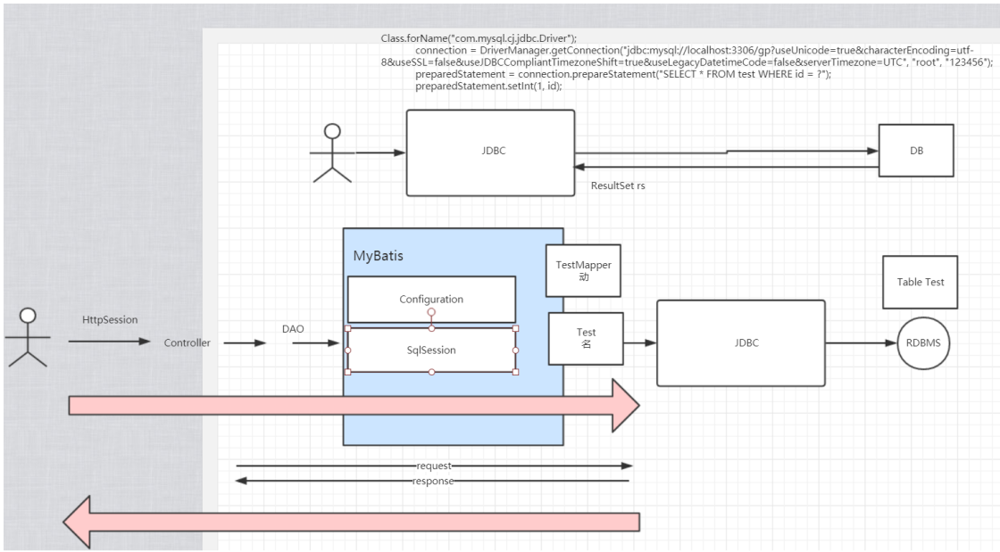
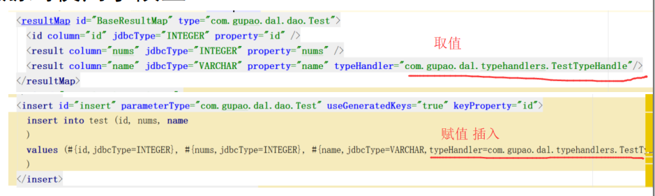
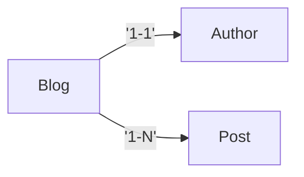

# 1. 认识MyBatis

**What is MyBatis?**

​		MyBatis is a first class persistence framework with support for custom SQL, stored procedures and advanced mappings. （MyBatis是什么）

​		MyBatis eliminates almost all of the JDBC code and manual setting of parameters and retrieval of results. （MyBatis的优势）

​		MyBatis can use simple XML or Annotations for configuration and map primitives, Map interfaces and Java POJOs (Plain Old Java Objects) to database records.（MyBatis如何做到的）


- MyBatis 是一款优秀的持久层框架，它支持自定义 SQL、存储过程以及高级映射。
- MyBatis 免除了几乎所有的 JDBC 代码以及设置参数和获取结果集的工作。
- MyBatis 可以通过简单的 XML 或注解来配置和映射原始类型、接口和 Java POJO（Plain Old Java Objects，普通老式 Java 对象）为数据库中的记录。


**对比JDBC和MyBatis**




# 2. 使用MyBatis

使用过程

- 编程式  不使用spring容器的方式
- 集成式   managed集成到spring

- 工作中的使用方式
  - 分析业务
  - 定义表结构
  - generator生成需要的类

- generator使用步骤

  - `pom.xml`配置generator插件

    - ```xml
      <plugin>
      	<groupId>org.mybatis.generator</groupId>
          <artifactId>mybatis-generator-maven-plugin</artifactId>
          <version>1.3.3</version>
          <configuration>
          	<configurationFile>${project.basedir}/src/main/resource/mybatis/generatorConfig.xml</configurationFile>
          </configuration>
      </plugin>
      ```

  - 配置`generatorConfig.xml`

  - 执行`mvn mybatis-generator:generate`

  - 生成Bean和Example

- 作用域 Scope

  - `SqlSessionFactoryBuilder`==>method
  - `SqlSessionFactory`==>application
  - `SqlSession`==>request/method(可以认为是线程级)
  - `Mapper`==>method

- Mapper的XML和annotation形式

  - 兼容？兼容形式-->互补

  - Pros vs cons

  - |              | Pros                                                         | Cons                                 |
    | ------------ | ------------------------------------------------------------ | ------------------------------------ |
    | `Mapper.xml` | - 跟接口分离、统一管理<br />- 复杂的语句可以不影响接口的可读性 | 过多的XML文件                        |
    | `Annotation` | - 接口就能看到sql语句，可读性高，不需要再去找xml文件，方便。 | 复杂的联合查询不好维护、代码可读性差 |

- Config 文件部分解读 http://www.mybatis.org/mybatis-3/configuration.html  

  - `environments`
  - `typeHandlers`：java 和表字段类型的转换实现）  
    - 定义`com.gupao.dal.config.MyBatisConfig#localSessionFactoryBean`
    - 注册到使用字段上
    - 
    - 做国际化的时候，Color数据库存 1 2，中文显示红 绿，英文显示 Red Green


# 3. Plugins

拦截范围

- `Executor(update, query, flushStatements, commit, rollback, getTransaction, close, isClosed)`
- `ParameterHandler(getParamenterObject, setParameters)`
- `ResultSetHandler(handleResultSets, handleOutputParameters)`
- `StatementHandler(prepare, parameterize, batch, update, query)`

使用方法

1. 定义`com.gupao.dal.plugins.TestPlugin`
2. 注册`com.gupao.dal.config.MyBatisCOnfig#localSessionFactoryBean`
3. 使用


# 4. 配置文件解读


mapper文件解读

1. `namespace`关联到接口方法，区分类似package的作用

2. `resultMap`/`resultType`

3. |              | Pros                                   | Cons           |
   | ------------ | -------------------------------------- | -------------- |
   | `resultType` | 多表关联字段是清楚知道的，性能调优直观 | 创建很多实体类 |
   | `resultMap`  | 不需要写join语句                       | N+1问题        |
   
4. sql：这个元素可以用来定义可重用的 SQL 代码片段，以便在其它语句中使用。https://mybatis.org/mybatis-3/zh/sqlmap-xml.html
   
5. select insert update delete CRUD

   1. 自增`<insert id="insert" parameterType="com.gupao.dal.dao.Test" useGeneratedKeys="true" keyPropertry="id"/>`

6. 动态sql http://www.mybatis.org/mybatis-3/dynamic-sql.html  
7. 缓存 https://mybatis.org/mybatis-3/zh/sqlmap-xml.html#cache
   1. 一级缓存：MyBatis默认开启一级缓存，它仅仅对一个session中的数据进行缓存。
   2. 二级缓存：启用二级缓存需要在SQL映射文件中使用`<cache/>`开启。或者在Mapper接口中使用`@CacheNamespaceRef`注解指定缓存作用域。
      1. 映射语句中的所有select语句的结果将会被缓存。
      2. 映射语句中的所有insert、update和delete语句会刷新缓存。
      3. 缓存会使用最少使用算法(LRU, least recently used)来清除不需要的缓存。
      4. 缓存不会定时进行刷新（也就说没有刷新间隔）
      5. 缓存会保存列表或对象（无论查询方法返回哪种）的1024个引用。
      6. 缓存会被视为读/写缓存，这意味着获取到的对象并不是共享的，可以安全地被调用者修改，而不干扰其他调用者或线程所做的潜在修改。
   3. 使用自定义缓存通过实现`org.apache.ibatis.cache.Cache`接口然后在`<cache type="com.domain.something.MyCustomCache"/>`
   4. `cache-ref`在别的`namespace`共享`<cache-ref namespace="com.someone.application.data.SomeMapper"/>`

# 5. 最佳实践

## 分页

**逻辑分页**：`org.apache.ibatis.executor.resultset.DefaultResultSetHandler#handleRowValuesForSimpleResultMap` 内存里分页。

**物理分页**

- select ... limit 0,10; 
- 分页插件 https://github.com/pagehelper/MybatisPageHelper  

## 批量操作

| 方式                             | 性能                | 说明                                                         |
| -------------------------------- | ------------------- | ------------------------------------------------------------ |
| for循环逐条插入                  | 低，每次要经过N次IO |                                                              |
| foreach拼SQL(性能最高、推荐使用) | 高                  | 有SQL长度限制，定好List大小<br />show variables like '%packet%'<br />show variables like '%net_buffer%' |
| `ExecutorType.BATCH`             |                     | 参考下面的`insertBatchExType()`                              |


```xml
<insert id="insertBatch" parameterType="list">
    insert into test(id, nums, name) values
    <foreach collection="list" item="item" separator=",">
    	(#{item.id, jdbcType=INTEGER}, #{item.nums, jdbcType=INTERGER}, #{item.name, jdbcType=VARCHAR})
    </foreach>
</insert>
```


```java
@Lazy(false)
@Bean(name="qlSessionFactory")
public SqlSessionFactory localSessionFactoryBean() throw Exception {
    SqlSessionFactoryBean sqlSessionFactoryBean = new SqlSessionFactoyBean();
    sqlSessionFactoryBean.setDataSource(dataSource);
    //sqlSessionFactoryBean.setTypeHandlers(new TypeHandler[]{new TestTypeHandler()});
    //sqlSessionFactoryBean.setTypeHandlersPackage("com.gupao.dal.typehandlers");
    //sqlSessionFactoryBean.setPlugins(new Interceptor[]{new TestPlugin()});
    sqlSessionFactoryBean.setPlugins(new Interceptor[]{pageInterceptor()});
    
    SqlSessionFactory factory = sqlSessionFactoryBean.getObject();
    // lazy loading switch
    factory.getConfiguration.setLazyLoadingEnabled(true);
    factory.getConfiguration.setAggressiveLazyLoading(false);
    factory.getConfiguration.setProxyFactory(new CglibProxyFactory());
    return factory;
}

@Lazy(false)
@Bean(name="batchSst")
public SqlSessionTemplate batchSst() throw Exception {
    return new SqlSessionTemplate(localSessionFactoryBean(), ExecutorType.BATCH);
}

@Autowired
@Qualifier("batchSst")
private SqlSessionTemplate sqlSessionTemplate;

@Test
@Transactional
public void insertBatchExType() {
    SqlSession session = sqlSessionTemplate.
        getSqlSessionFactory().openSession(ExecutorType.BATCH, false);
    TestMapper testMapper = session.getMapper(com.gupao.dal.dao.TestMapper.class);
    long start = System.currentTimeMillis();
    for (int i = 0; i < 1000; i++) {
        com.gupao.dal.dao.Test test = new com.gupao.dal.dao.Test();
        test.setName(TestEnum.A.name());
        test.setNums(i);
        mapper.insert(test);
        if (i%5==0&&i!=0) {
            session.commit();
            session.clearCache();
        }
    }
    log.info("cost {}ms", System.currentTimeMillis() - start);
}
```


## 联合查询

数据结构关系



- Lazy loading
- localSessionFactoryBean

```java
@Lazy(false)
@Bean(name="qlSessionFactory")
public SqlSessionFactory localSessionFactoryBean() throw Exception {
    SqlSessionFactoryBean sqlSessionFactoryBean = new SqlSessionFactoyBean();
    sqlSessionFactoryBean.setDataSource(dataSource);
    //sqlSessionFactoryBean.setTypeHandlers(new TypeHandler[]{new TestTypeHandler()});
    //sqlSessionFactoryBean.setTypeHandlersPackage("com.gupao.dal.typehandlers");
    //sqlSessionFactoryBean.setPlugins(new Interceptor[]{new TestPlugin()});
    sqlSessionFactoryBean.setPlugins(new Interceptor[]{pageInterceptor()});
    
    SqlSessionFactory factory = sqlSessionFactoryBean.getObject();
    // lazy loading switch
    factory.getConfiguration.setLazyLoadingEnabled(true);
    factory.getConfiguration.setAggressiveLazyLoading(false);
    factory.getConfiguration.setProxyFactory(new CglibProxyFactory());
    return factory;
}
```


### 嵌套查询 两次查询

一对一

`association` 关联

```xml
<!-- 嵌套查询 start 1:1 -->
<resultMap id="blogResultMap" type="com.gupao.dal.resultmap.BlogResultMap">
	<id column="bid" jdbcType="INTEGER" property="bid"/>
	<result column="name" jdbcType="VARCHAR" property="name"/>
    <association property="author" column="author_id"
                 select="com.gupao.dal.dao.AuthorMapper.selectByPrimaryKey"/>
</resultMap>

<select id="selectBlogAuthor" resultMap="blogResultMap" parameterType="int">
	select
    <include refid="Base_Colum_List"/>
    from blog
    where bid = #{id, jdbcType=INTERGER}
</select>
<!-- 嵌套查询 end 1:1 -->
```


```java
package com.gupao.dal.resultmap;

@Data
public class BlogResultMap {
	private Integer bid;
    private String name;
    private Author author;
}    
```


一对多

`collection`集合

```xml
<!-- 嵌套查询 1:N start -->
<resultMap id="blogPostsResultMap" type="com.gupao.dal.resultmap.BlogPostsResultMap">
	<id column="bid" jdbcType="INTEGER" property="bid"/>
    <result column="name" jdbcType="VARCHAR" property="name"/>
    <result column="author_id" jdbcType="INTEGER" property="authorId"/>
    <collection column="bid" property="posts" 
                select="selectByBlogId" ofType="com.gupao.dal.dao.Posts">
    </collection>
</resultMap>

<select id="selectBlogPosts" resultMap="blogPostsResultMap2" paramterType="int">
	select
    <include refid="Base_Column_List"/>
    from blog
    where bid=#{id, jdbcType=INTEGER} order by bid asc
</select>
<!-- 嵌套查询 end -->
```


### 嵌套结果 join 一次查询

一对一

`association` 关联

```xml
<!-- 嵌套结果 start 1:1-->
<resultMap id="blogResultMap2" type="com.gupao.dal.resultmap.BlogResultMap">
	<id column="bid" jdbcType="INTEGER" property="bid"/>
    <result column="name" jdbcType="VARCHAR" property="name"/>
    <association property="author" javaType="com.gupao.dal.dao.Author">
    	<id cloumn="aid" jdbcType="INTEGER" property="aid"/>
        <result cloumn="author_name" jdbcType="VARCHAR" property="authorName"/>
    </association>
</resultMap>

<select id="selectBlogAuth2" resultMap="blogResultMap2" parameterType="int">
	select 
    * 
    from blog b,author a
    where bid=#{id, jdbcType=INTEGER}
    and b.author_id=a.aid
</select>
<!-- 嵌套结果 end 1:1-->
```


一对多

`collection` 集合

```xml
<!-- 嵌套结果 1:N start -->
<resultMap id="blogPostsResultMap2" type="com.gupao.dal.resultmap.BlogPostsResultMap2">
	<id column="bid" jdbcType="INTEGER" property="bid"/>
    <result column="name" jdbcType="VARCHAR" property="name"/>
    <result column="author_id" jdbcType="INTEGER" property="authorId"/>
    <collectio property="posts"  ofType="com.gupao.dal.dao.Posts">
        <id property="pid" jdbcType="INTEGER" column="post_id"/>
        <result column="comment" jdbcType="VARCHAR" property="comment"/> 
    </collection>
</resultMap>

<select id="selectBlogPosts" resultMap="blogPostsResultMap2" paramterType="int">
	select
    <include refid="Base_Column_List"/>
    from blog
    where bid=#{id, jdbcType=INTEGER} order by bid asc
</select>
<!-- 嵌套结果 end -->
```


## N+1 问题

https://blog.csdn.net/qq_40910541/article/details/80813431

> N+1问题来源于数据库中常见的级联技术，即N个数据库表形成关联关系，当查询1张表的时候有N张关联查询表。
>
> 由于某些时候，我们并不需要加载所有的关联数据，而是某一张表的数据，这时MyBatis会自动加载所有关联表的数据，多执行几条无关sql语句。

> 嵌套查询会出现N+1问题，以及可能的套娃套中套问题。

**如何解决N+1问题**

> MyBatis本身给出解决方案，就是延迟加载

**延迟加载**

> 延迟加载会解决上述的N+1问题，也就是在N+1个关联表的情况下，只加载需要的数据。这是互联网发展的需要，性能提升的途径。

**如何配置延迟加载**

```shell
全局配置：
	- lazyLoadingEnabled        true/false
	- aggressiveLazyLoading      true/false
	
	lazyLoadingEnabled:延迟加载的全局开关，当开启时，所有关联都会延迟加载。在特定的关联中，
使用fetchType属性覆盖该内容的功能。fetchType将在后面介绍。

	aggressiveLazyLoading：是层级延迟加载开关，什么意思呢？就是处于同一个层级的关联表会同
时延迟加载，或者同时被加载。
	
	配置：
		在Mybatis的全局配置中的setting标签中加入设置
		<setting>
			<setting name="lazyLoadingEnabled" value="true"/>
			<setting name="aggressiveLazyLoading" value="true"/>
		</setting>
```

**全局配置的优化**

> MyBatis使用`fetchType`属性解决全局配置的缺点。`fetchType`出现在级联元素`association`、`collection`中，它存在两个值。

```xml
- eager:获得当前POJO后立即加载对应的数据。
- lazy:获得当前POJO后延迟加载对应的数据。
	
配置：
<collection properties=".." column=".." fetchType="eager" select="映射接口" />
```


