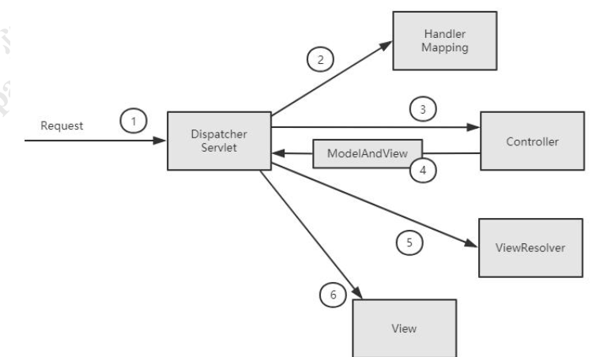

# Spring MVC初体验

[TOC]

## 初探Spring MVC请求处理流程

​		引用《Spring in Action》上的一张图来了解Spring MVC的核心组件和大致处理流程

​		从上图中

1. DispatcherServlet是Spring MVC中的前端控制器(Front Controller)负责接收Request并将Request转发给对应的处理组件。
2. HandlerMapping是Spring MVC中完成url到Controller映射的组件。DispatcherServlet从HandlerMapping查找并处理Request的Controller。
3. Controller处理Request，并返回ModelAndView对象，Controller是Spring MVC中负载处理Request的组件（类似于Struts2的Action），ModelAndView是封装结果视图的组件。
4. ModelAndView、ViewResolver、View视图解析器解析ModelAndView对象并返回对应的视图给客户端。

​		容器初始化时会建立所有url和Controller中的Method的对应关系，保存到HandlerMapping中，用户请求是根据Request请求的url快速定位到Controller中的某个方法。在Spring中先将url和Controller的对应关系，保存到Map<url, Controller>中。Web容器启动时会通知Spring初始化容器（加载Bean的定义信息和初始化所有单例Bean），然后Spring MVC会遍历容器中的Bean，获取每一个Controller中的所有方法访问的url，然后将url和Controller保存到一个Map中；这样就可以根据Request快速定位到Controller，因为最终处理Request的是Controller中的方法，Map中只保留了url和Controller的对应关系，所以要根据Request的url进一步确认Controller中的Method，这一步工作的原理就是拼接Controller的url(Controller上@RequestMapping的值)和方法的url（Method上@RequestMapping的值），与Request的url进行匹配，找到匹配的那个方法；确定处理请求的Method后，接下来的任务就是参数绑定，把Request中参数绑定到方法的形参上，这一步是整个请求处理过程中最复杂的一个步骤。

## Spring MVC九大组件

### HandlerMappings

​		HandlerMappings是用来查找Handler的，也就是处理器，具体的表现形式可以是类也可以是方法。比如，标注了@RequestMapping的每一个Method都可以看成是一个Handler，有Handler来负责实际的请求处理。HandlerMapping在请求到达之后，它的作用便是找到请求相应的Handler和Interceptors。

### HandlerAdapters

​		从名字上看，这是一个适配器。因为Spring MVC中Handler可以是任何形式的，只要能够处理请求便行，但是把请求交给Servlet的时候，由于Servlet的方法结构都是如doService(HttpServletRequest req, HttpServletResponse resp)这样的形式，让固定的Servlet处理方法调用Handler来进行处理，这一步工作便是HandlerAdapters要做的事。

### HandlerExceptionResolvers

​		从这个组件的名字上看，这个就是用来Handler过程中产生的异常处理的组件。具体来说，此组件的作用是根据异常设置ModelAndView，之后再交给render()方法进行渲染，而render()便将ModelAndView渲染成页面。不过有一点，HandlerExceptionResolvers只是用于解析对请求处理阶段产生的异常，而渲染阶段的异常则不归它管了，这也是Spring MVC组件设计的一大原则分工明确互不干涉。

### ViewResolvers

​		视图解析器，相信大家对这个应该都很熟悉了。因为通常在Spring MVC的配置文件中，都会配上一个该接口的实现类来进行视图的解析。这个组件的主要作用，便是将String类型的视图名和Locale解析为View类型的视图。这个接口只有一个resolveViewName()方法。从方法的定义就可以看出，Controller层返回的String类型的视图名viewName，最终会在这里被解析成View。View是用来渲染页面的，也就是说，它会将程序返回的参数和数据填入模板中，最终生成html文件。ViewResolvers在这个过程中，主要做两件大事：

- ViewResolver会找到渲染所用的模板（使用什么模板来渲染？）
- ViewResolver会找到渲染所用的技术（其实也就是视图的类型，如JSP还是其他什么的）填入参数

> 默认情况下，Spring MVC会为我们自动配置一个InternalResourceViewResolver，这个是针对JSP类型视图的。

### RequestToViewNameTranslator

​		这个组件的作用，在于从Requst中获取viewName。因为ViewResolver是根据viewName查找View，但有的Handler处理完成之后，没有设置View也没有设置viewName，便要通过这个组件来从Request中查找viewName。

### LocaleResolver

​		在上面我们有看到ViewResolver的resolveViewName()方法，需要两个参数。那么第二个参数Locale是从哪来的呢？这就是LocaleResolver要做的事情了。LocaleResolver用于从Request中解析出Locale，在中国大陆区域，Locale当然就会是zh-CN，用来表示一个区域。这个类也是i18n的基础。

### ThemeResolver

​		从名字便可看出，这个类是用来解析主题的。主题，就是样式，图片以及它们所形成的显示效果的集合。Spring MVC中一套主体对于一个properties文件，里面存放着跟当前主题相关的所有资源，如图片，css样式等。创建主体非常简单，只需准备好资源，然后新建一个“主题名.properties”并将资源设置进去，放在classpath下，便可以在页面中使用了。Spring MVC中跟主体有关的类有ThemResolver，ThemSource和Theme。ThremResolver负责从Request中解析出主题名，ThemeSource则根据主题名找到具体的主体，其抽象也就是Theme，通过Theme来获取主题和具体的资源。

### MultipartResolver

​		其实这是一个大家很熟悉的组件，MultipartResolver用于处理上传请求，通过将普通的Request包装层MultipartHttpServletRequest来实现。MultipartHttpServletRequest可以通过getFile()直接获得文件，如果是多个文件上传，还可以通过调用getFileMap()得到Map<FileName, File>这样的结构。MultipartResolver的作用就是用来封装普通的Request，使其拥有处理文件上传的功能。

### FlashMapManager

​		说道FlashMapManager，就得先提一下FlashMap。

​		FlashMap用于重定向Redirect时的参数数据传递，比如，在处理用户订单请求时，为了避免重复提交，可以处理完post请求后redirect到一个get请求，这个get请求可以用来显示订单详情之类的信息。这样做虽然可以规避用户刷新重新提交表单的问题，但是在这个页面上要显示订单的信息，那这些数据从哪里去获取呢，因为redirect重定向是没有传递参数这一功能的，如果不想把参数写进url（其实也不推荐这么做，url有长度限制不说，把参数都直接暴露，感觉也不安全），那么久通过flashMap来传递。只需要在redirect之前，将要传递的数据写入request（可以通过ServletRequestAttributes.getRequest()获得）的属性OUTPUT_FLASH_MAP_ATTRUBUTE中，这样在redirect之后的handler中Spring就会自动将其设置到Model中，在显示订单信息的页面上，就可以直接从Model中取得数据了。而FlashMapManager就是用来管理FlashMap的。

# Spring MVC源码分析

## 初始化阶段

## 运行阶段

# Spring MVC使用优化建议