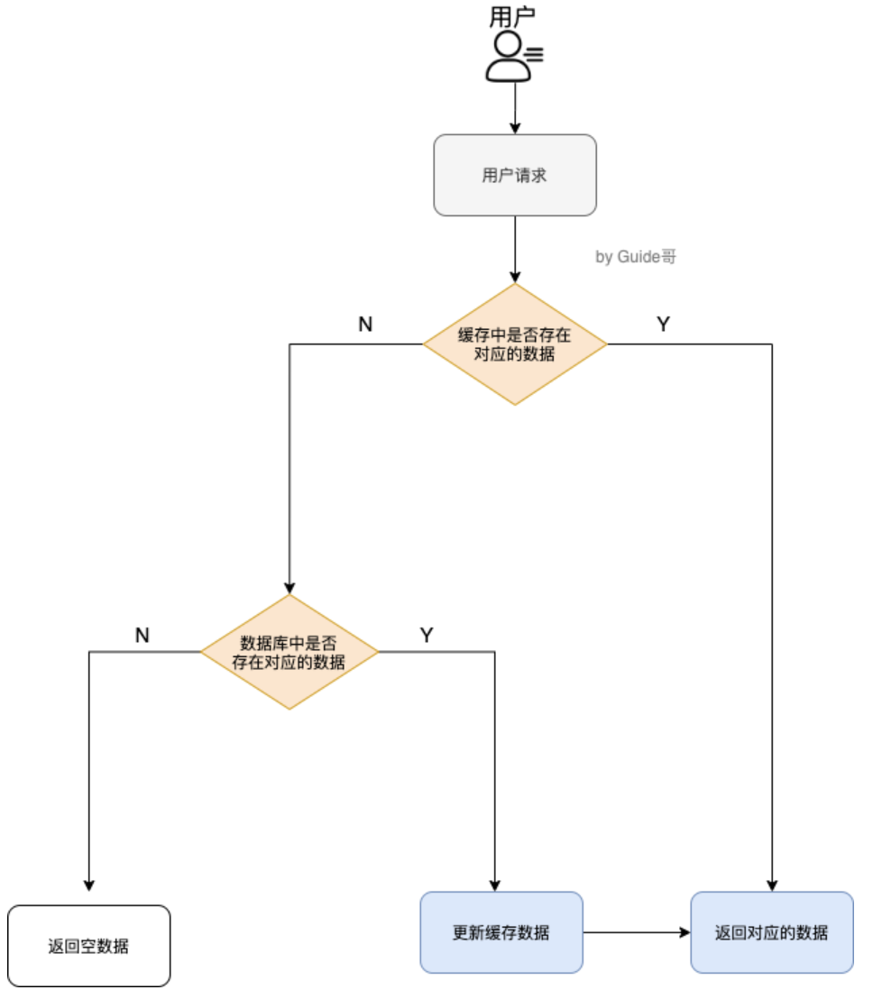
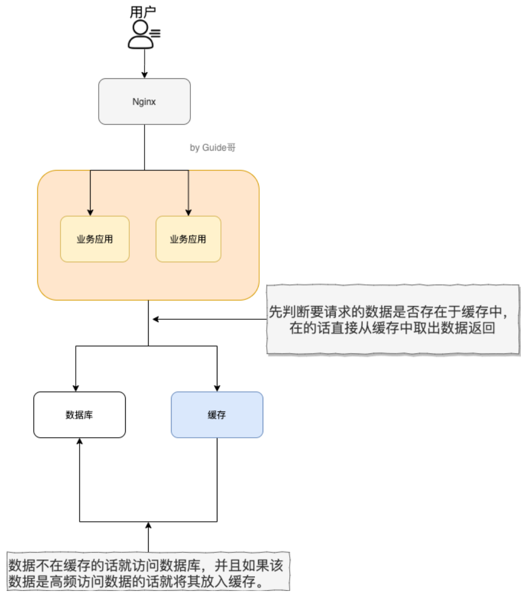
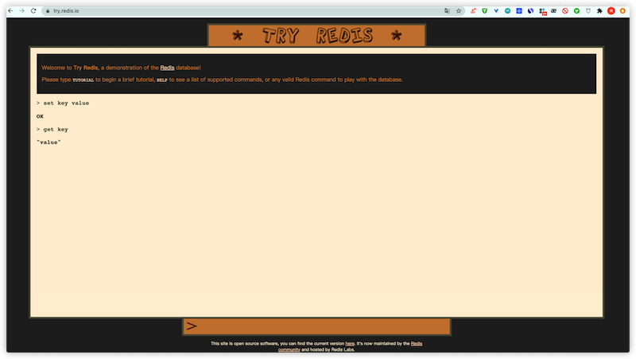
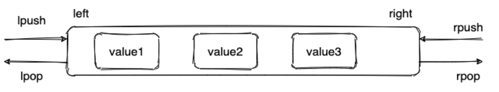
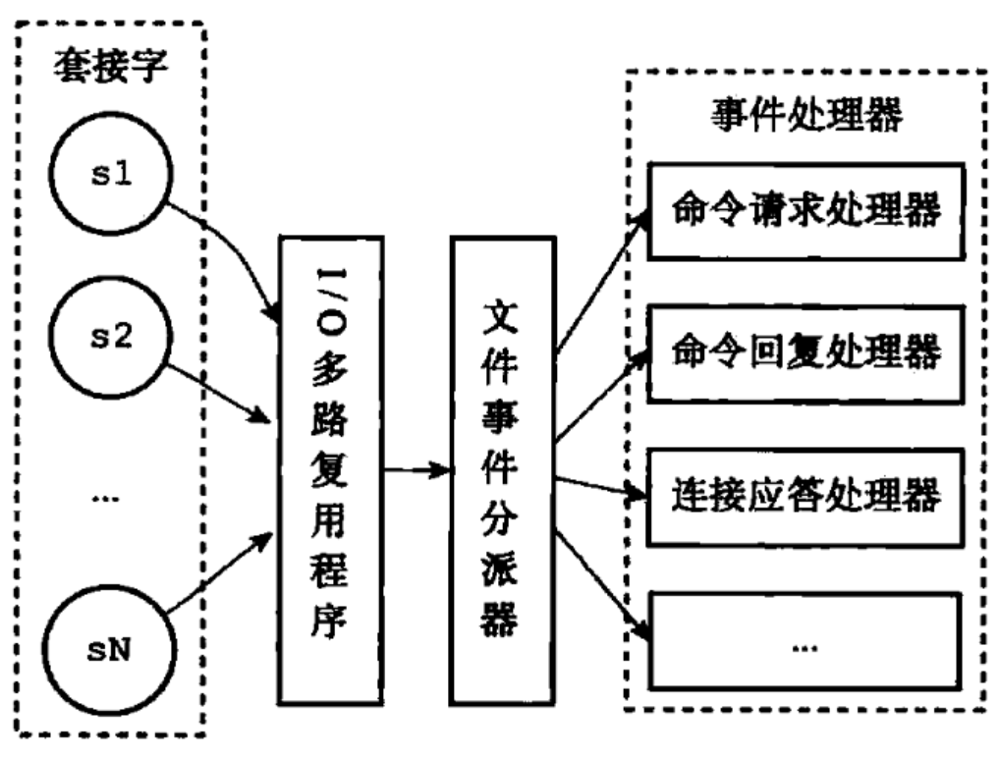
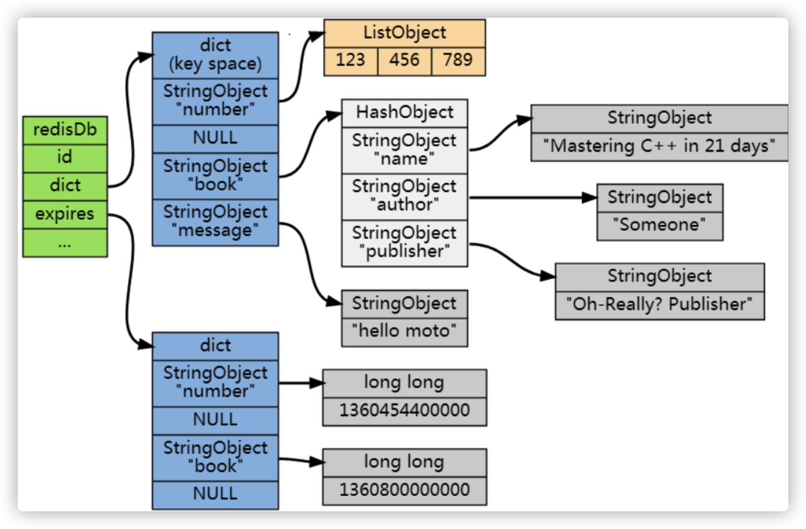
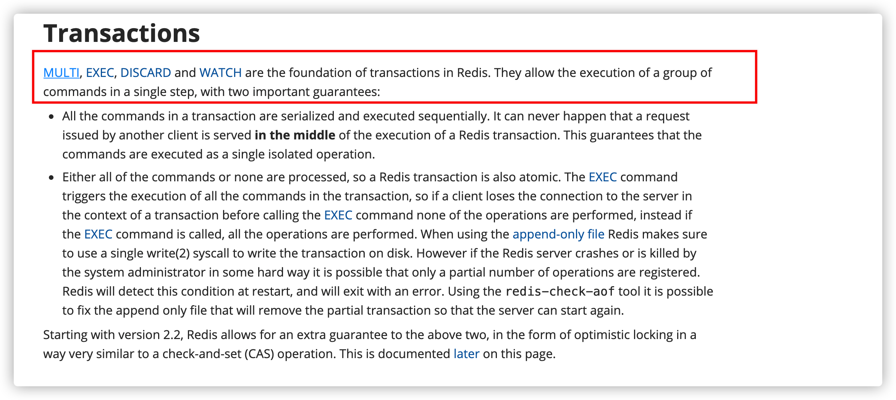
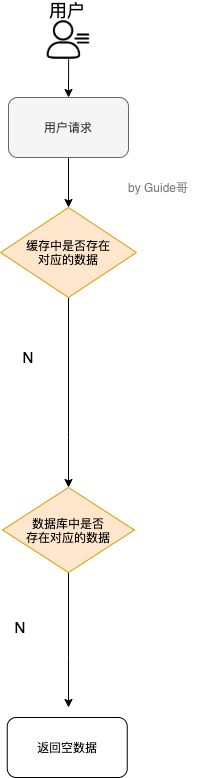

# 简单介绍一下Redis

​		简单来说**Redis就是一个使用C语言开发的数据库**，不过与传统数据库不同的是**Redis的数据是存储在内存中**，也就是说它是内存数据库，所以读写速度非常快，因此Redis被广泛应用于缓存方向。

​		另外，**Redis除了做缓存之外，Redis也经常用来做分布式锁，甚至是消息队列。**

​		**Redis提供了多种数据类来支持不同的业务场景。Redis还支持事务、持久化、Lua脚本、多种集群方案。**

# 分布式缓存常见的技术选型方案有哪些？

​		分布式缓存的话，使用的比较多的主要是Membercache和Redis。不过，现在基本没有看过还有项目使用Membercache来做缓存，都是直接用Redis。

​		Membercache是分布式缓存最开始兴起的那会，比较常用。后来，随着Redis的发展，大家慢慢都转而使用更加强大的Redis了。

​		分布式缓存主要解决的是单机缓存的容量受服务器限制并且无法保存通用的信息。因为，本地缓存只在当前服务里有效，比如如果你部署了两个相同的服务，它们两者之间的缓存数据是无法共通的。

# 说一下Redis和Membercache的区别和共同点

​		现在公司一般都是用Redis来实现缓存，而且Redis自身也越来越强大了！不过，了解Redis和Membercache的区别和共同点，有助于我们在做相应的技术选型的时候，能够做到有理有据！

**共同点** ：

1. 都是基于内存的数据库，一般都用来当做缓存使用。
2. 都有过期策略。
3. 两者的性能都非常高。

**区别** ：

1. **Redis 支持更丰富的数据类型（支持更复杂的应用场景）**。Redis 不仅仅支持简单的 k/v 类型的数据，同时还提供 list，set，zset，hash 等数据结构的存储。Membercache只支持最简单的 k/v 数据类型。
2. **Redis 支持数据的持久化，可以将内存中的数据保持在磁盘中，重启的时候可以再次加载进行使用,而 Membercache把数据全部存在内存之中。**
3. **Redis 有灾难恢复机制。** 因为可以把缓存中的数据持久化到磁盘上。
4. **Redis 在服务器内存使用完之后，可以将不用的数据放到磁盘上。但是，Membercache在服务器内存使用完之后，就会直接报异常。**
5. **Membercache没有原生的集群模式，需要依靠客户端来实现往集群中分片写入数据；但是 Redis 目前是原生支持 cluster 模式的.**
6. **Membercache是多线程，非阻塞 IO 复用的网络模型；Redis 使用单线程的多路 IO 复用模型。** （Redis 6.0 引入了多线程 IO ）
7. **Redis 支持发布订阅模型、Lua 脚本、事务等功能，而 Membercache不支持。并且，Redis 支持更多的编程语言。**
8. **Membercache过期数据的删除策略只用了惰性删除，而 Redis 同时使用了惰性删除与定期删除。**

相信看了上面的对比之后，我们已经没有什么理由可以选择使用 Membercache来作为自己项目的分布式缓存了。

# 缓存数据的处理流程是怎样的？

流程图



简单来说就是：

1. 如果用户请求的数据在缓存中就直接返回。
2. 缓存中不存在的话就看数据库中是否存在。
3. 数据库中存在的话就更新缓存中的数据。
4. 数据库中不存在的话就返回空数据。


# 为什么要用Redis？为什么要用缓存？

> 简单来说使用缓存主要是为了提升用户体验以及应对更多的用户。

下面我们主要从“高性能”和“高并发”这两点来看待这个问题。



**高性能**

对照上面的图。我们设想这样的场景

加入用户第一次访问数据库中的某些数据的话，这个过程是比较慢，毕竟是从硬盘读取的。但是，如果说，用户访问的数据属于高频数据并且不会经常改变的话，那么我们就可以很放心地将该用户访问的数据存在缓存中。

**这样有什么好处呢？**那就是保证用户下一次再访问这些数据的时候就可以直接从缓存中获取了。操作缓存就是直接操作内存，所以速度相当快。

不过，要保持数据库和缓存中的数据的一致性。如果数据库中的对应数据改变之后，同步改变缓存中相应的数据即可！

**高并发**

一般像MySQL这类的数据库的QPS大概都在1W左右(4核8G)，但是使用Redis缓存之后很容易达到10W+，甚至最高性能能达到30W+(就单机redis的情况，redis集群的话会更高)。

> QPS(Query Per Second)：服务器每秒可执行的查询次数。

所以，直接操作缓存能够承受的数据库请求数量是远远大于直接访问数据库的，所以我们可以考虑把数据库中的部分数据转移到缓存中去，这样用户的一部分请求直接到缓存这里而不经过数据库。进而，我们也就提高了系统整体的并发。

# Redis常见数据结构以及使用场景分析

你可以自己本机安装 redis或者通过 redis 官网提供的[在线 redis 环境](https://try.redis.io/)。



## string

**介绍**：string数据结构是简单的key-value类型。虽然Redis是用C语言写的，但是Redis并没有使用C的字符串表示，而是自己构建了一种**简单动态字符串**(simple dynamic string, SDS)。相比于C的原生字符串，Redis的SDS不光可以保存文本数据还可以保存二进制数据，并且获取字符串长度的时间复杂度为O(1)，C字符串为O(n)，除此之外，Redis的SDS API是安全的，不会造成缓冲区溢出。

**常用命令**：set, get, strlen, exists, dect, incr, setex等等。

**应用场景**：一般常用在需要计数的场景， 比如用户的访问次数、热点文章的点赞转发数量等等。

下面我们简单看看它的使用！


**普通字符串的基本操作**

```shell
> set key value   	# 设置key-value类型的值
OK
> get key			# 根据key获得对应的value
"value"
> exists key		# 判断某个key是否存在
(integer) 1
> strlen key		# 返回key所存储的字符串值的长度
(integer) 5
> del key			# 删除某个key对应的值
(integer) 1
> get key			
(nil)
```

**批量操作**

```shell
> mset key1 value1 key2 value2		# 批量设置key-value类型的值
OK
> mget key1 key2					# 批量获取多个key对应的value
1) "value1"
2) "value2"
```

**计数器（字符串的内容为整数的时候可以使用）**

```shell
> set number 1
OK
> incr number		# 将key存储的数字增加一
(integer) 2
> get number
"2"
> decr number		# 将key存储的数字减一
(integer) 1
> get number
"1"
```

**过期**

```shell
> expire key 60			# 数据在60s后过期
(integer) 1
> setex key 60 value	# 数据在60s后过期(setex:[set] + [ex]pire)
OK
> ttl key				# 查看数据还有多久过期
(integer) 57
```


## list

**介绍**：**list既是链表**。链表是一种常见的数据结构，特点是易于数据元素的插入和删除并且可以灵活调整链表长度，但是链表的随机访问困难。许多高级编程语言都内置了链表的实现比如Java的`LinkedList`，但是C语言没有实现链表，所以Redis实现了自己的链表数据结构。Redis的list的实现为一个**双向链表**，既可以支持反向查找和遍历，更方便操作，不过带来了部分额外的内存开销。

**常用命令**：rpush、rpop、lpush、lpop、lrange、llen等。

**应用场景**：发布与订阅或者说消息队列、慢查询。


下面我们简单看看它的使用！

**通过`rpush/lpop`实现队列**

```shell
> rpush myList value1				# 向list的头部(右边)
(integer) 1
> rpush myList value2 value3		# 向list的头部(右边)添加多个元素
(integer) 3
> lpop myList						# 将list的尾部(最左边)元素取出
"value1"
> lrange myList 0 1					# 查看对应下标的list列表，0为start，1为end
1) "value2"
2) "value3"
> lrange myList 0 -1				# 查看列表中的所有元素，-1表示倒数第一
1) "value2"
2) "value3"
```

**通过`rpush/rpop`实现栈**

```shell
> rpush myList2 value1 value2 value3
(integer) 3
> rpop myList2							# 将list的头部(最右边)元素取出
"value3"
```



**通过`lrange`查看对于下标范围的列表元素**

```shell
> rpush myList value1 value2 value3
(integer) 5
> lrange myList 0 1					# 查看对应下标的list列表， 0 为 start,1为 end
1) "value2"
2) "value3"
> lrange myList 0 -1				# 查看列表中的所有元素，-1表示倒数第一
1) "value2"
2) "value3"
3) "value1"
4) "value2"
5) "value3"
```

通过`lrange`命令，你可以基于list实现分页查询，性能非常高！

**通过`llen`查看列表长度**

```shell
> llen myList
(integer) 5
```


## hash

**介绍**：hash类似于JDK 1.8前的HashMap，内部实现也差不多（数组+链表）。不过，Redis的hash做了更多优化。另外，hash是一个string类型的field和value的映射表，**特别适合用于存储对象**，后续操作的时候，你可以直接仅仅修改这个对象中的某个字段的值。比如我们可以用hash数据结构来存储用户信息，商品信息等待。

**常用命令**：hset、hmset、hexists、hget、hgetall、hkeys、hvals等。

**应用场景**：系统中对象数据的存储。

下面我们简单看看它的使用！

```shell
> hset userInfoKey name "guide" description "dev" age "24"	# 新增
3
> hexists userInfoKey name			# 查看key对应的value中指定的字段是否存在
(integer) 1
> hget userInfoKey name				# 获取存储在哈希表中指定字段的值
"guide"
> hget userInfoKey age		
"24"
> hgetall userInfoKey				# 获取在哈希表中所有key和value
1) "name"
2) "guide"
3) "description"
4) "dev"
5) "age"
6) "24"
> hkeys userInfoKey					# 获取key列表
1) "name"
2) "description"
3) "age"
> hvals userInfoKey					# 获取value列表
1) "guide"
2) "dev"
3) "24"
> hset userInfoKey name "guideGeGe"	# 修改某个字段对应的值
0
> hget userInfoKey name
"guideGeGe"
```


## set

[交集、差集、并集](https://jingyan.baidu.com/article/22fe7ced4e36bd7002617fae.html)

**介绍**：set类似于Java中的`HashSet`。Redis中的set类型一种无序集合，集合中的元素没有先后顺序。当你需要存储一个列表数据，又不希望出现重复数据时，set是一个很好的选择，并且set提供了判断某个成员是否在一个set集合内的重要接口，这个也是list所不能提供的。可以基于set轻易实现交集、并集、差集的操作。比如：你可以将一个用户所有的关注人存在一个集合中，将其所有粉丝存在一个集合。Redis可以非常方便的实现如同共同关注、共同粉丝、共同喜好等功能。这个过程也就是求交集的过程。

**常用命令**：sadd、spop、smembers、sismember、scard、sinterstore、sunion等。

**应用场景**：需要存放的数据不能重复以及需要获取多个数据源交易和并集等场景。

下面我们简单看看它的使用！

```shell
> sadd mySet value1 value2					# 添加元素
(integer) 2
> sadd mySet value1							# 不允许有重复元素
(integer) 0
> smembers mySet							# 查看set中的所有元素
1) "value1"
2) "value2"
> scard mySet								# 查看set的长度
2
> sismember mySet value1					# 检查某个元素是否存在set中，只能接收单个元素
(integer) 1
> sadd mySet2 value2 value3
(integer) 2
> sinterstore mySet3 mySet mySet2			# 获取mySet和mySet2的交易并存放在mySet3中
1
> smembers mySet3
1) "value2"
```


## sorted set

**介绍**：和set相比，sorted set增加了一个权重参数score，使得集合中的元素能够按score进行有序排列，还可以通过score的范围来获取元素的列表。有点像Java中HashMap和TreeSet的结合体。

**常用命令**：zadd、zcard、zscore、zrange、zrevrange、zrem等。

**应用场景**：需要对数据根据某个权重进行排序的场景。比如在直播系统中，实时排行信息包含直播间在线用户列表，各种礼物排行榜，弹幕消息（可以理解为按消息纬度的消息排行榜）等信息。

```shell
> zadd myZset 3.0 value1				# 添加元素到 sorted set中3.0为权重
(integer) 1
> zadd myZset 2.0 value2 1.0 value3		# 批量添加
(integer) 2
> zcard myZset							# 查看sorted set中的元素数量
3
> zscore myZset value1					# 查看某个value的权重
3.0
> zrange myZset 0 -1					# 顺序输出某个范围区间的元素，0 -1 表示输出所有元素
1) "value3"
2) "value2"
3) "value1"	
> zrange myZset 0 1						# 顺序输出某个范围区间的元素，0 为 start  1 为 stop
1) "value3"
2) "value2"
> zrevrange myZset 0 1					# 逆序输出某个范围区间的元素，0 为 start  1 为 stop
1) "value1"
2) "value2"
```


# Redis单线程模型详解

​		**Redis基于Reactor模式来设计开发了自己的一套高效的事件处理模型**（Netty的线程模型也基于Reactor模式，Reactor模式不愧是高性能IO的基石），这套事件处理模型对应的是Redis中的文件事件处理器(file event handler)。由于文件处理器(file event handler)是单线程方式运行的，所以我们一般都说Redis是单线程模型。


**既然是单线程，那么怎么监听大量的客户端连接呢？**

​		Redis通过**IO多路复用程序**来监听来自客户端的大量连接（或者说是监听多个socket），它会将感兴趣的事件及类型（读、写）注册到内核中并监听每个事件是否发生。

​		这样的好处非常明显：**IO多路复用技术的使用让Redis不需要额外创建多余的线程来监听客户端的大量连接，降低了资源的消耗**(和NIO中的`Selector`组件很像)。

​		另外，Redis服务器是一个事件驱动程序，服务器需要处理两类事件：1.文件事件；2.事件时间。

​		时间事件不需要多花时间了解，我们接触最多的还是**文件事件**（客户端进行读取写入等操作，涉及一系列网络通信）。

《Redis设计与实现》有一段话是介绍文件事件的

> Redis 基于 Reactor 模式开发了自己的网络事件处理器：这个处理器被称为文件事件处理器（file event handler）。文件事件处理器使用 I/O 多路复用（multiplexing）程序来同时监听多个套接字，并根据 套接字目前执行的任务来为套接字关联不同的事件处理器。
>
> 当被监听的套接字准备好执行连接应答（accept）、读取（read）、写入（write）、关 闭（close）等操作时，与操作相对应的文件事件就会产生，这时文件事件处理器就会调用套接字之前关联好的事件处理器来处理这些事件。
>
> **虽然文件事件处理器以单线程方式运行，但通过使用 I/O 多路复用程序来监听多个套接字**，文件事件处理器既实现了高性能的网络通信模型，又可以很好地与 Redis 服务器中其他同样以单线程方式运行的模块进行对接，这保持了 Redis 内部单线程设计的简单性。

​		可以看出，文件事件处理器(file event handler)主要包含4个部分

- 多个socket(客户端连接)
- IO多路复用程序(支持多个客户端连接的关键)
- 文件事件分派器(将socket关联到相应的事件处理器)
- 事件处理器(连接应答处理器、命令请求处理器、命令回复处理器)



> 《Redis设计与实现：12章》

# Redis没有使用多线程？为什么不使用多线程？

​		虽然说Redis是单线程模型，但是，实际上，**Redis在4.0之后的版本中就已经加入对多线程的支持。**


​		不过，Redis 4.0增加的多线程主要是针对一些大键值对的删除操作的命令，使用这些命令就会使用主处理之外的其它线程来“异步处理”。

​		大体上来说，**Redis 6.0之前主要还是单线程处理。**

​		**那，Redis 6.0之前为什么不使用多线程？**

​		我觉得主要原因有下面3个

1. 单线程编程容易并且更加容易维护
2. Redis的性能瓶颈不在CPU，主要在内存和网络
3. 多线程就会存在死锁、线程上下文切换等问题，甚至会影响性能。

# Redis 6.0 之后为何引入了多线程？

​		**Redis 6.0引入多线程主要是为了提高网络IO读写性能**，因为这个算是Redis中的一个性能瓶颈（Redis的瓶颈主要受限于内存和网络）。

​		虽然，Redis 6.0引入了多线程，但是Redis的多线程只是在网络数据的读写这类耗时操作上使用了，执行命令仍然是单线程顺序执行。因此，你也不需要担心线程安全问题。

​		Redis 6.0的多线程默认是禁用的，只使用主线程。如需开启需要修改Redis配置文件`redis.conf`

```shell
io-threads-do-reads yes
```

​		开启多线程后，还需要设置线程数，否则是不生效的。同样需要修改Redis配置文件`redis.conf`

```shell
io-threads 4 #官网建议4核的机器建议设置为2或3个线程，8核的建议设置为6个线程
```

推荐阅读：

1. [Redis 6.0 新特性-多线程连环 13 问！](https://mp.weixin.qq.com/s/FZu3acwK6zrCBZQ_3HoUgw)
2. [为什么 Redis 选择单线程模型](https://draveness.me/whys-the-design-redis-single-thread/)

# Redis给缓存数据设置过期时间有啥用？

​		一般情况下，我们设置保存的缓存数据的时候都会设置一个过期时间。为什么呢？

​		因为内存是有限的，如果缓存中的所有数据都是一直保存的话，分分钟直接Out of memory。

​		Redis自带了给缓存数据设置过期时间的功能，比如

```shell
127.0.0.1:6379> exp key  60 # 数据在 60s 后过期
(integer) 1
127.0.0.1:6379> setex key 60 value # 数据在 60s 后过期 (setex:[set] + [ex]pire)
OK
127.0.0.1:6379> ttl key # 查看数据还有多久过期
(integer) 56
```

​		注意：**Redis中除了字符串类型有自己独有设置过期时间的命令`setex`外，其他方法都需依靠`expire`命令来设置过期时间。另外`persist`命令可以移除一个键的过期时间**

​		**过期时间除了有助于缓解内存的消耗，还有神庙其他用呢？**

​		很多时候，我们的业务行级就是需要某个数据只在某一时间段内存在，比如我们的短信验证码可能只在1分钟内有效，用户登录的token可能只在一天内有效。

​		如果使用传统的数据库来处理的话，一般都是自己判断过期，这样更麻烦并且性能要差很多。

# Redis是如何判断数据是否过期的呢？

​		Redis通过一个叫做过期字典（可以看作是hash表）来保存数据过期的时间。过期字典的键指向Redis数据库中的某个key(键)，过期字典的值是一个long类型的整数，这个整数保存了key所指向的数据库键的过期时间（毫秒精度的UNIX时间戳）。



​		过期字典是存储在redisDb这个结构里的

```c
typedef struct redisDb {
    ...
    
    dict *dict;     //数据库键空间,保存着数据库中所有键值对
    dict *expires   // 过期字典,保存着键的过期时间
    ...
} redisDb;
```


# 过期数据的删除策略了解吗？

​		如果假设你设置了一批key只能存活1分钟，那么1分钟后，Redis是怎么对这批key进行删除的呢？

​		常用的过期数据的删除策略就两个（重要！自己造缓存轮子的时候需要格外考虑的东西）

1. **惰性删除**：只会在取出key的时候才对数据进行过期检查。这样对CPU最友好，但是可能造成太多过期key没有删除。
2. **定期删除**：每隔一段时间抽取一批key执行删除过期key操作。并且，Redis底层会通过限制删除操作执行的时长和频率来减少删除操作对CPU时间的影响。


​		定期删除对内存更加优化，惰性删除对CPU更加友好。两者各有千秋，所以Redis采用的是**定期删除+惰性删除。**

​		但是，仅仅通过给key设置过期时间还是有问题的。因为还是可能存在定期删除和惰性删除漏掉了很多过期key的情况。这样就导致大量过期key堆积在内存里，然后就Out of memory了。

​		怎么解决这个问题呢？答案是：**Redis内存淘汰机制。**


# Redis内存淘汰机制了解吗？

> 相关问题：MySQL里有2000W数据，Redis中只存20W的数据，如何保证Redis中的数据都是热点数据？

Redis提供6中数据淘汰策略

1. **volatile-lru(least recently used)**：从已设置过期时间的数据集(`server.db[i].expires`)中挑选最近最少使用的数据淘汰。
2. **volatile-ttl**：从已设置过期时间的数据集(`server.db[i].expires`)中挑选将要过期的数据淘汰。
3. **volatile-random**：从已设置过期时间的数据集(`server.db[i].expires`)中任意选择数据淘汰。
4. **allkeys-lru(least recently used)**：当内存不足以容纳新写入数据时，在键空间中，移除最近最少使用的key（**这个淘汰机制最常用**）。
5. **allkeys-random**：从数据集(`server.db[i].expires`)中任意选择数据淘汰。
6. **no-eviction**：禁止驱逐数据，也就是说当内存不足以容纳新写入数据时，新写入操作就会报错。

4.0 版本后增加以下两种

7. **volatile-lfu(least frequently used)**：从已设置过期时间的数据集(`server.db[i].expires`)中挑选最不经常使用的数据淘汰。
8. **allkeys-lfu(least frequently used)**：当内存不足以容纳新写入数据时，在键空间中，移除最不经常使用的key。

# Redis持久化机制（怎么保证Redis挂掉之后再重启数据可以进行恢复）

​		很多时候我们需要持久化数据也就是将内存中的数据写入到硬盘里面，大部分原因是为了之后重用数据（比如重启机器、机器故障之后恢复数据），或者是为了防止系统故障而将数据备份到一个远程位置。

​		Redis不同于Membercache的很重要一点就是，Redis支持持久化，而且支持两种不同的持久化操作。**Redis的一种持久化方式叫做快照（snapshotting, RDB ），另一种方式是追加文件（append-only file, AOF）。**这两种方法各有千秋。


**快照（snapshotting）持久化（RDB）**

​		Redis可以通过创建快照来获得存储在内存里面的数据在某个时间点上的副本。Redis创建快照之后，可以对快照进行备份，可以将快照复制到其他服务器从而创建具有相同数据的服务副本（Redis主从结构，主要用来提高Redis性能），还可以将快照留在原地以便重启服务器的时候使用。

​		快照持久化是Redis默认采用的持久化方式，在`redis.conf`配置文件中默认由此下配置

```shell
save 900 1           #在900秒(15分钟)之后，如果至少有1个key发生变化，Redis就会自动触发BGSAVE命令创建快照。
save 300 10          #在300秒(5分钟)之后，如果至少有10个key发生变化，Redis就会自动触发BGSAVE命令创建快照。
save 60 10000        #在60秒(1分钟)之后，如果至少有10000个key发生变化，Redis就会自动触发BGSAVE命令创建快照。
```


**AOF(append-only file)持久化**

​		与快照持久化相比，AOF持久化的实时性更好，因此已成为主流的持久化方案。默认情况下Redis没有开启AOF（append-only file）方式的持久化，可以通过`applyonly`参数开启

```shell
appendonly yes
```

​		开启AOF持久化每执行一条会更改Redis中数据的命令，Redis就会将该命令写入硬盘的AOF文件。AOF文件的保存位置和RBD文件位置相同，都是通过`dir`参数设置的，默认的文件名是`appendonly.aof`。

​		在Redis的配置文件中存在三种不同的AOF持久化方式，它们分别是

```shell
appendfsync always    #每次有数据修改发生时都会写入AOF文件,这样会严重降低Redis的速度
appendfsync everysec  #每秒钟同步一次，显示地将多个写命令同步到硬盘
appendfsync no        #让操作系统决定何时进行同步
```

​		为了兼顾数据和写入性能，用户可以考虑`appendsync everysec`选项，让Redis每秒同步一次AOF文件，Redis性能几乎没受到任何影响。而且这样即使出现系统崩溃，用户最多只会丢失一秒之内产生的数据。当硬盘忙于执行写入操作的时候，Redis还会优雅的放慢自己的速度以便适应硬盘的最大写入速度。

**相关 issue** ：[783：Redis 的 AOF 方式](https://github.com/Snailclimb/JavaGuide/issues/783)

**拓展：Redis 4.0 对于持久化机制的优化**

​		Redis 4.0 开始支持 RDB 和 AOF 的混合持久化（默认关闭，可以通过配置项 `aof-use-rdb-preamble` 开启）。

​		如果把混合持久化打开，AOF 重写的时候就直接把 RDB 的内容写到 AOF 文件开头。这样做的好处是可以结合 RDB 和 AOF 的优点, 快速加载同时避免丢失过多的数据。当然缺点也是有的， AOF 里面的 RDB 部分是压缩格式不再是 AOF 格式，可读性较差。

**补充内容：AOF 重写**

​		AOF 重写可以产生一个新的 AOF 文件，这个新的 AOF 文件和原有的 AOF 文件所保存的数据库状态一样，但体积更小。

​		AOF 重写是一个有歧义的名字，该功能是通过读取数据库中的键值对来实现的，程序无须对现有 AOF 文件进行任何读入、分析或者写入操作。

​		在执行 BGREWRITEAOF 命令时，Redis 服务器会维护一个 AOF 重写缓冲区，该缓冲区会在子进程创建新 AOF 文件期间，记录服务器执行的所有写命令。当子进程完成创建新 AOF 文件的工作之后，服务器会将重写缓冲区中的所有内容追加到新 AOF 文件的末尾，使得新旧两个 AOF 文件所保存的数据库状态一致。最后，服务器用新的 AOF 文件替换旧的 AOF 文件，以此来完成 AOF 文件重写操作。

# Redis事务

​		Redis可以通过`MULTI`、`EXEC`、`DISCARD`和`WATCH`等命令来实现事务(transaction)功能。

```shell
> MULTI
OK
> INCR foo
QUEUED
> INCR bar
QUEUED
> EXEC
1) (integer) 1
2) (integer) 1
```

​		使用 [MULTI](https://redis.io/commands/multi)命令后可以输入多个命令。Redis不会立即执行这些命令，而是将它们放到队列，当调用了[EXEC](https://redis.io/commands/exec)命令将执行所有命令。

​		Redis官网相关介绍 https://redis.io/topics/transactions 如下：



​		但是，Redis 的事务和我们平时理解的关系型数据库的事务不同。我们知道事务具有四大特性： **1. 原子性**，**2. 隔离性**，**3. 持久性**，**4. 一致性**。

1. **原子性（Atomicity）：** 事务是最小的执行单位，不允许分割。事务的原子性确保动作要么全部完成，要么完全不起作用；
2. **隔离性（Isolation）：** 并发访问数据库时，一个用户的事务不被其他事务所干扰，各并发事务之间数据库是独立的；
3. **持久性（Durability）：** 一个事务被提交之后。它对数据库中数据的改变是持久的，即使数据库发生故障也不应该对其有任何影响。
4. **一致性（Consistency）：** 执行事务前后，数据保持一致，多个事务对同一个数据读取的结果是相同的；


**Redis 是不支持 roll back 的，因而不满足原子性的（而且不满足持久性）。**

​		Redis官网也解释了为什么不支持回滚。简单来说就是Redis开发者觉得没必要支持回滚，这样更简单便捷并且性能更好。Redis开发者觉得即使命令执行错误也应该在开发过程中就被发现而不是生产过程中。


​		你可以将Redis中的事务就理解为：**Redis事务提供了一种将多个命令请求打包的功能。然后，在按顺序执行打包的所有命令，并且不会被中途打断。**

**相关issue** :[issue452: 关于 Redis 事务不满足原子性的问题](https://github.com/Snailclimb/JavaGuide/issues/452) ，推荐阅读：https://zhuanlan.zhihu.com/p/43897838 。

# 缓存穿透

## 什么是缓存穿透？

​		缓存穿透简单点说就是大量请求的key根本不存在与缓存中，导致请求直接到了数据库上，根本没有经过缓存这一层。举个例子：某个黑客故意制造我们缓存中不存在的key发起大量请求，导致大量请求落到数据库。

## 缓存穿透情况的处理流程是怎样的？

如下图所示，用户请求最终都要跑到数据库中查询一遍。




## 有哪些解决办法？

​		最基本的就是首先做好参数校验，一些不合法的参数请求直接抛出异常信息返回给客户端。比如查询的数据库id不能小于0、传入的邮箱格式不对的时候直接返回错误消息给客户端等等。


**一、缓存无效key**

​		如果缓存和数据都查不到某个key的数据就写一个到Redis中去设置过期时间，具体命令如下：`SET key value EX 10086`。这种方式可以解决请求的key变化不频繁的情况，如果黑客恶意攻击，每次构建不同的key，会导致Redis中缓存大量无效的key。很明显，这种方案不能从根本上解决此问题。如果非要用这种方式来解决穿透问题的话，尽量将无效的key的过期时间设置短一点比如1分钟。

​		另外，这里多说一嘴，一般情况下我们是这样设计 key 的： `表名:列名:主键名:主键值` 。

​		如果用 Java 代码展示的话，差不多是下面这样的：

```java
public Object getObjectInclNullById(Integer id) {
    // 从缓存中获取数据
    Object cacheValue = cache.get(id);
    // 缓存为空
    if (cacheValue == null) {
        // 从数据库中获取
        Object storageValue = storage.get(key);
        // 缓存空对象
        cache.set(key, storageValue);
        // 如果存储数据为空，需要设置一个过期时间(300秒)
        if (storageValue == null) {
            // 必须设置过期时间，否则有被攻击的风险
            cache.expire(key, 60 * 5);
        }
        return storageValue;
    }
    return cacheValue;
}
```


**二、布隆过滤器**

​		布隆过滤器是一个非常神奇的数据结构，通过它我们可以非常方便地判断一个给定数据是否存在于海量数据中。我们需要的就是判断key是否合法，有没有感觉布隆过滤器就是我们想要找的那个“人”。

​		具体是这样做的：把所有可能存在的请求的值都存放在布隆过滤器中，当用户请求过来，先判断用户发来的请求的值是否存在于布隆过滤器中。不存在的话，直接返回请求参数错误信息给客户端，存在的话才会走下面的流程。

​		加入布隆过滤器之后的缓存处理流程如下。


​		但是，需要注意的是布隆过滤器可能会存在误判的情况。总结来说就是：**布隆过滤器说某个元素存在，小概率会误判。布隆过滤器说某个元素不在，那么这个元素一定不在。**

​		为什么会出现误判的情况呢？我们还要从布隆过滤器的原理来说！

​		我们先来看一下，**当一个元素加入布隆过滤器中的时候，会进行哪些操作**

1. 使用布隆过滤器中的哈希函数对元素进行计算，得到哈希值（有几个哈希函数得到几个哈希值）。
2. 根据得到的哈希值，在位数组中把对应的下标的值设置为1.


​		我们再来看一下，**当我们需要判断一个元素是否存在于布隆过滤器的时候，会进行哪些操作**

1. 对给定元素再次进行相同的哈希计算
2. 得到值之后判断位数组中的每个元素是否都为1，如果值为1，那么说明这个值在布隆过滤器中，如果存在一个值不为1，说明该该元素不在布隆过滤器中。


​		然后，一定会出现这样一种情况：**不同的字符串可能哈希出来的位置相同。**（可以适当增加为数组大小或者调整我们的哈希函数来降低概率）。

​		更多关于布隆过滤器的内容可以看我的这篇原创：[《不了解布隆过滤器？一文给你整的明明白白！》](https://github.com/Snailclimb/JavaGuide/blob/master/docs/dataStructures-algorithms/data-structure/bloom-filter.md) ，强烈推荐，个人感觉网上应该找不到总结的这么明明白白的文章了。

# 缓存雪崩

## 什么缓存雪崩？

​		缓存雪崩描述的就是这样一个简单的场景：**缓存在同一时间大面积的失效，后面的请求都直接落到了数据库上，造成数据库短时间内承受大量请求。**这就好比雪崩一样，摧枯拉朽之势，数据库的压力可想而知，可能直接就被这么多请求弄宕机了。

​		举个例子：系统的缓存模块出了问题比如宕机导致不可用。造成系统的所有访问，都要走数据库。

​		还有一种缓存雪崩的场景是：**以一些大量访问数据（热点数据）在某一时刻大面积失效，导致对应的请求直接落到了数据库上。**这样的情况，有以下几种解决办法：

​		举个例子：秒杀开始12个小时之前，我们统一存放了一批商品到Redis中，设置的缓存过期时间也是12小时，那么秒杀开始的时候，这些秒杀的商品访问直接就失效了。导致的情况就是，相应的请求直接就落到了数据库上，就像雪崩一样可怕。

## 有哪些解决办法？

**针对Redis服务不可用的情况**

1. 采用Redis集群，避免单机出现问题整个缓存服务都没办法使用。
2. 限流，避免同时处理大量请求。

**针对热点缓存失效的情况**

1. 设置不同的失效时间比如随机设置缓存的失效时间。
2. 缓存永不失效。

# 如何保证缓存与数据库双写时的数据一致性？

​		细说的话可以扯很多，但是我觉得其实没太大必要（很多方案弄得人不明不白）。我个人觉得引入缓存之后，如果为了短时间的不一致性问题，选择让系统设计变得更加复杂的话，完全没必要。

​		下面单独针对**Cache Aside Pattern（旁路缓存模式）**来聊聊

​		Cache Aside Pattern中遇到写请求是这样的：更新DB，然后直接删除cache。

​		如果更新DB成功，而删除缓存这一步失败的情况的话，简单说两个解决方案

1. **缓存失效时间变短（不推荐，治标不治本）**：我们让缓存数据的过期时间变短，这样的话缓存就会从数据库中加载数据。另外，这种解决办法对于先操作缓存后操作数据库的场景不使用。
2. **增加cache更新重试机制（常用）**：如果cache服务当前不可用导致缓存删除失败的话，我们就隔一段时间进行重试，重试次数可以自己定。如果多次重试还是失败的话，我们可以把当前更新失败的key存入队列中，等待缓存服务可用之后，再将缓存中对应的key删除即可。