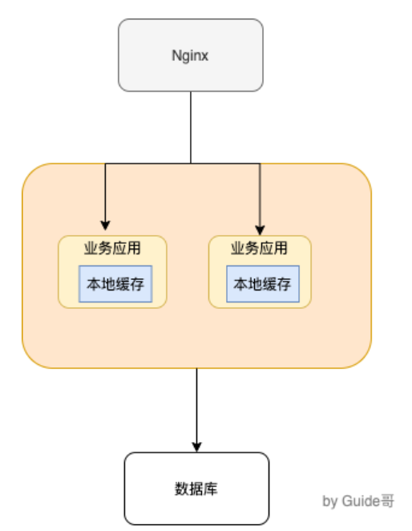
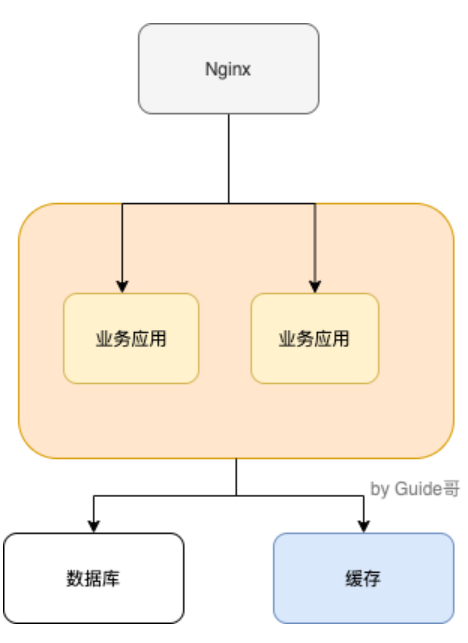

# 缓存的基本思想

​		很多朋友，只知道缓存可以提高系统性能以及减少请求响应时间，但是，不太清楚缓存的本质思想是什么。

​		缓存的基本思想其实很简单，就是我们非常熟悉的空间换时间，不要把缓存想的太高大上，虽然，它的确对系统的性能提升的性价比非常高。

​		其实，我们在学习使用缓存的时候，你会发现缓存的思想实际在操作系统或者其他地方都被大量用到。比如**CPU Cache是内存数据用于解决CPU处理速度和内存不匹配的问题，内存缓存时硬盘数据用于解决硬盘访问速度过慢的问题。再比如操作系统在页表方案基础之上引入了快表来加速虚拟地址到物理地址的转换。我们可以把块表理解为一种特殊的告诉缓冲存储器（Cache）。**

​		回归到业务系统来说：**我们为了避免用户在请求数据的时候获取速度过于缓慢，所以我们在数据之上增加了缓存这一层来弥补。**

# 使用缓存为系统带来了什么问题

​		**软件系统设计中没有银弹，往往任何技术的引入都像是把双刃剑。**你使用的方式得当，就能为系统带来很大的收益。否则，只是费了精力不讨好。

​		简单来说，为系统引入缓存之后往往会带来下面的这些问题：

> 其实我觉得引入本地缓存来做一些简单业务场景的话，实际带来的代价几乎可以忽略，下面主要是针对分布式缓存来说的。

1. **系统复杂性增加**：引入缓存之后，你要维护缓存和数据库一致性、维护热点缓存等待。
2. **系统开发成本往往会增加**：引入缓存意味着系统需要一个单独的缓存服务，这是需要花费相应的成本，并且这个成本还是很贵的，毕竟耗费的是宝贵的内存。但是，如果你只是简单的使用一下本地缓存存储一下简单的数，并且数据量不大的话，那么就不需要单独去弄一个缓存服务。

# 本地缓存解决方案

​		先来聊聊本地缓存，这个实际在很多项目中用的蛮多，特别是单体架构的时候。数据量不大，并且没有分布式要求的话，使用本地缓存还是可以的。

​		常见的单体架构图如下，我么使用**Nginx**来做**负载均衡**，部署两个相同的服务到服务器，两个服务使用同一个数据，并且使用的是本都缓存。

**一、JDK自带的`HashMap`和`ConcurrentHashMap`**

​		`ConcurrentHashMap`可以看作是线程安全的`HashMap`，两者都是存放key/value形式的键值对。但是，大部分场景来说不会使用这两者当作缓存，因为只提供了缓存的功能，并没有提供其他诸如过期时间之类的功能。一个稍微完善一点的缓存框架至少要提供：**过期时间**、**淘汰机制**、**命中率统计**这三点。

**二、`Ehcache`、`Guava Cache`、`Spring Cache`这三者是使用的比较多的本地缓存框架**

- `Ehcache`：相比其他两者更加重量级。不过，相比于`Guava Cache`、`Spring Cache`来说，`Ehcache`支持可以嵌入到hibernate和mybatis作为多级缓存，并且可以将缓存的数据持久化到本地磁盘中、同时也提供了集群方案(比较鸡肋可忽略)。
- `Guava Cache`和`Spring Cache`两者比较像。`Guava`相比于`Spring Cache`的话使用的更多一点，他提供了API非常方便我们使用，同时也提供了设置缓存有效时间等功能。它的内部实现也比较干净，很多地方都和`ConcurrentHashMap`的思想有异曲同工之妙。
- 使用`Spring Cache`的注解实现缓存的话，代码会看着很干净和优雅，但是很容易出现问题比如缓存穿透、内存溢出。

**三、后起之秀Caffeine**

​		相比于`Guava`来说`Caffeine`在各个方面比如性能要更加优秀，一般建议使用其来代替`Guava`。并且，`Guava`和`Caffeine`的使用方式很像！

> 本地缓存固然好，但是缺陷也很明显，比如多个相同服务器之间的本地缓存的数据无法共享。

# 为什么要有分布式缓存？为什么不直接用本地缓存？

​		本地缓存的优势非常明显：**低依赖、轻量、简单、成本低**

​		但是，本地缓存

1. **本地缓存对分布式架构支持不友好**，比如同一个相同的服务部署在多台机器上的时候，各个服务之间的缓存是无法共享的，因为本地缓存只在当前机器上有。
2. **本地缓存容量受服务部署所在的机器限制明显**，如果当前系统服务所消耗的内存多，那么本地缓存可用的容量就很少。

> **我们可以把分布式缓存(Distributed Cache)看作是一种内存数据库的服务，它的最终作用就是提供缓存数据的服务。**

​		如下图所示，就是一个简单的使用分布式缓存的架构图。我们使用Nginx来做负载均衡，部署两个相同的服务到服务器，两个服务使用同一个数据库和缓存。

​		使用分布式缓存之后，缓存部署在一台单独的服务器上，即使同一个相同的服务部署在再多机器上，也是使用的同一份缓存。并且，单独的分布式缓存服务的性能、容量和提供的功能都要更加强大。

​		使用分布式缓存的缺点呢？也很显而易见，那就是你需要为分布式缓存引入额外的服务比如Redis或Membercache，你需要单独保证Redis或Membercache服务的高可用。

# 缓存读写模式/更新策略

​		**下面介绍到的三种模式各有优劣，不存在最佳模式，根据具体的业务场景选择适合自己的缓存读写模式。**

## Cache Aside Pattern(旁路缓存模式)

1. 写：更新DB，然后直接删除cache。

2. 读：从cache中读取数据，读取到就直接返回，读取不到的话，就从DB中去取数据返回，然后再把数据放到cache中。

   ​	Cache Aside Pattern中服务端需要同时维系DB和Cache，并且是以DB的结果为准。另外，Cache Aside Pattern有首次请求数据一定不在cache的问题，对于热点数据可以提前放入缓存中。

## Read/Write Through Pattern(读写穿透模式)

​		Read/Write Through Pattern套路是：服务端把cache视为主要数据存储，从中读取数据并将数据写入其中。cache服务负责将此数据读取和吸入DB，从而减轻了应用程序的职责。

1. 写(Write Through)：先查cache，cache中不存在，直接更新DB。cache中存在，则先更新cache，然后cache服务自己更新DB**(同步更新cache和DB)**。
2. 读(Read Through)：从cache中读取数据，读取到就直接返回。读取不到的话，先从DB加载，写入到cache后返回响应。

​		Read-Through Pattern实际只是Cache-Aside Pattern之上进行了封装。在Cache-Aside Patter下，发生读请求的时候，如果cache中不存在对应的数据，是由客户端自己负责把数据写入cache， 而Read Through Pattern则是cache服务自己来写入缓存的，这对客户端是透明的。

​		和Cache Aside Pattern一样，Read-Through Pattern也有首次请求数据一定不在cache的问题，对于热点数据可以提前放入缓存中。

## Write Behind Pattern(异步缓存写入)

​		Write Behind Pattern和Read/Write Through Patter很相似，两者都是有cache服务来负载cache和DB的读写。

​		但是，两者又有很大的不同：**Read/Write Through 是同步更新cache和DB，而Write Behind则是只更新缓存，不直接更新Db ,而是改为异步批量的方式来更新DB。**

​		**Write Behind Pattern下DB的写性能非常高，尤其适合一些数据经常变化的业务场景比如说一篇文章的点赞数量、阅读数量。**往常一篇文章被点赞500次的话，需要重复修改500次DB，但是在Write Behind Pattern下可能只需要修改一次DB就可以了。

​		但是，这种模式同样也给DB和Cache一致性带了新的考验，很多时候如果数据还没异步更新到DB的话，Cache服务宕机就gg了。