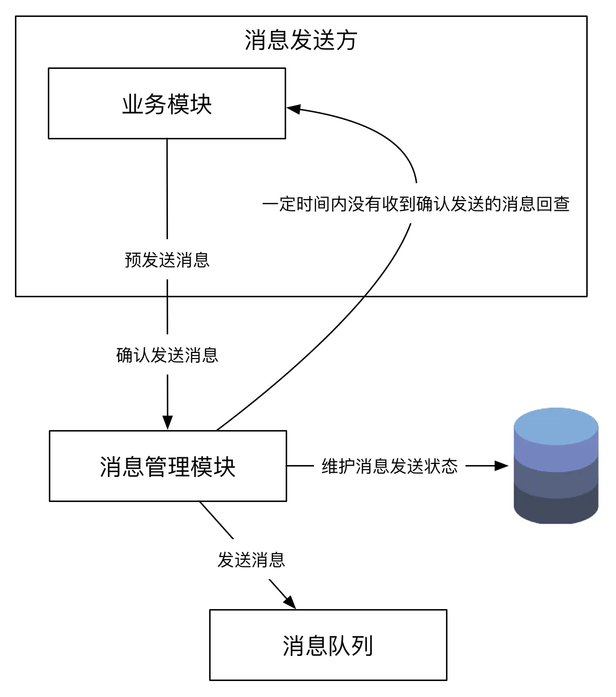

参考链接：https://www.jianshu.com/p/1156151e20c8

# 场景

本节列举不一致会导致的种种问题，这也包括一例生活中的问题。

### 案例1：买房

假如你想要享受生活的随意，只想买个两居，不想让房贷有太大压力，而你媳妇却想要买个三居，还得带花园的，那么你们就不一致了，不一致导致生活不愉快、不协调，严重情况下还会吵架，可见生活中的不一致问题影响很大。

### 案例2：转账

转账是经典的不一致案例，设想一下银行为你处理一笔转账，扣减你账户上的余额，然后增加别人账户的余额；如果扣减你的账户余额成功，增加别人账户余额失败，那么你就会损失这笔资金。反过来，如果扣减你的账户余额失败，增加别人账户余额成功，那么银行就会损失这笔资金，银行需要赔付。对于资金处理系统来说，上面任何一种场景都是不允许发生的，一旦发生就会有资金损失，后果是不堪设想的，严重情况会让一个公司瞬间倒闭，可参考[案例](https://link.jianshu.com?t=http://blog.jobbole.com/50392/)。

### 案例3：下订单和扣库存

电商系统中也有一个经典的案例，下订单和扣库存如何保持一致，如果先下订单，扣库存失败，那么将会导致超卖；如果下订单没有成功，扣库存成功，那么会导致少卖。两种情况都会导致运营成本的增加，严重情况下需要赔付。

### 案例4：同步超时

服务化的系统间调用常常因为网络问题导致系统间调用超时，即使是网络很好的机房，在亿次流量的基数下，同步调用超时也是家常便饭。系统A同步调用系统B超时，系统A可以明确得到超时反馈，但是无法确定系统B是否已经完成了预定的功能或者没有完成预定的功能。于是，系统A就迷茫了，不知道应该继续做什么，如何反馈给使用方。（曾经的一个B2B产品的客户要求接口超时重新通知他们，这个在技术上是难以实现的，因为服务器本身可能并不知道自己超时，可能会继续正常的返回数据，只是客户端并没有接受到结果罢了，因此这不是一个合理的解决方案）。

### 案例5：异步回调超时

此案例和上一个同步超时案例类似，不过这个场景使用了异步回调，系统A同步调用系统B发起指令，系统B采用受理模式，受理后则返回受理成功，然后系统B异步通知系统A。在这个过程中，如果系统A由于某种原因迟迟没有收到回调结果，那么两个系统间的状态就不一致，互相认知不同会导致系统间发生错误，严重情况下会影响核心事务，甚至会导致资金损失。

### 案例6：掉单

分布式系统中，两个系统协作处理一个流程，分别为对方的上下游，如果一个系统中存在一个请求，通常指订单，另外一个系统不存在，则导致掉单，掉单的后果很严重，有时候也会导致资金损失。

### 案例7：系统间状态不一致

这个案例与上面掉单案例类似，不同的是两个系统间都存在请求，但是请求的状态不一致。

### 案例8：缓存和数据库不一致

交易相关系统基本离不开关系型数据库，依赖关系型数据库提供的ACID特性（后面介绍），但是在大规模高并发的互联网系统里，一些特殊的场景对读的性能要求极高，服务于交易的数据库难以抗住大规模的读流量，通常需要在数据库前垫缓存，那么缓存和数据库之间的数据如何保持一致性？是要保持强一致呢还是弱一致性呢？

### 案例9：本地缓存节点间不一致

一个服务池上的多个节点为了满足较高的性能需求，需要使用本地缓存，使用了本地缓存，每个节点都会有一份缓存数据的拷贝，如果这些数据是静态的、不变的，那永远都不会有问题，但是如果这些数据是半静态的或者常被更新的，当被更新的时候，各个节点更新是有先后顺序的，在更新的瞬间，各个节点的数据是不一致的，如果这些数据是为某一个开关服务的，想象一下重复的请求走进了不同的节点（在failover或者补偿导致的场景下，重复请求是一定会发生的，也是服务化系统必须处理的），一个请求走了开关打开的逻辑，同时另外一个请求走了开关关闭的逻辑，这导致请求被处理两次，最坏的情况下会导致灾难性的后果，就是资金损失。

### 案例10：缓存数据结构不一致

这个案例会时有发生，某系统需要种某一数据结构的缓存，这一数据结构有多个数据元素组成，其中，某个数据元素都需要从数据库中或者服务中获取，如果一部分数据元素获取失败，由于程序处理不正确，仍然将不完全的数据结构存入缓存，那么缓存的消费者消费的时候很有可能因为没有合理处理异常情况而出错。

# 模式

## ACID(酸)

​		如何保证强一致性呢？计算机专业的同学在学习关系型数据库的时候都学习了ACID，这里对ACID做个简单的介绍。如果想全面的学习ACID原理，请参考[ACID](https://link.jianshu.com/?t=https://en.wikipedia.org/wiki/ACID)。

​		关系型数据库天生就是解决具有复杂事务场景的问题，关系型数据完全满足ACID的特性。

​		ACID指的是

- Atomic：原子性
- Consistency：一致性
- Isolation：隔离性
- Durability：持久性

​		具有ACID特性的数据库支持强一致性，强一致性代表数据库本身不会出现不一致，每个事务是原子的，或者成功或者失败，事务间是隔离的，互相完全不影响，而且最终状态是持久化落盘的，因此，数据库会从一个明确的状态到另一个明确的状态，中间的临时状态是不会出现的，如果出现也会及时的自动修复，因此是强一致性。

​		3个典型的关系型数据Oracle、MySQL, DB2都能保证强一致性，Oracle和MySQL使用多版本控制协议实现，而DB2使用改进的二阶段提交协议来实现。

​		如果你在为交易相关系统做技术选型，交易的存储应该只考虑关系型数据库，对于核心系统，如果需要较好的性能，可以考虑使用更强悍的硬件，这种向上扩展（升级硬件）虽然成本较高，但是是最简单粗暴有效的方式，另外NoSQL完全不适合交易场景，NoSQL主要用来做数据分析、ETL、报表、数据挖掘、推荐、日志处理等非交易场景。

​		然而，前面提到，互联网项目多数具有大规模高并发的特性，必须应用拆分的理念，对高并发的压力采取“大而化小、小而化了”的方法，否则难以满足动辄亿级流量的需求，即使使用关系型数据库，单机也难以满足存储和TPS上的需求。为了保证*案例2-转账*可以利用关系型数据库的强一致性，在拆分的时候尽量的把转账相关的账户放入一个数据库分片，对于案例3，尽量的保证把订单和库存放入同一个数据库分片，这样通过关系型数据库自然就解决了不一致的问题。

​		然而，有些时候事与愿违，由于业务规则的限制，无法将相关的数据分到同一个数据库分片，这个时候我们就需要实现最终一致性。

​		对于`案例2-转账`场景，假设账户数量巨大，对账户存储进行了拆分，关系型数据库一种分了8个实例，每个实例8个库，每个库8张表，共512张表，假如要转账的两个账户正好落在了同一个库里，那么可以依赖关系型数据库的事务保持强一致性。

​		如果要转账的两个账户正好落在了不同的库里，转账操作是无法封装在同一个数据库事务中的，这个时候会发生一个库的账户扣减余额成功，另外一个库的账户增加余额失败的情况。

​		对于这种情况，我们需要继续探讨解决之道，CAP原理和BASE原理，BASE原理通过记录事务的中间的临时状态，实现最终一致性。

## CAP(帽)

​		如果想深入的学习CAP理论，请参考[CAP](https://link.jianshu.com/?t=https://en.wikipedia.org/wiki/CAP_theorem)。

​		如果对系统或者数据进行了拆分，我们的系统不再是单机系统，而是分布式系统，针对分布式系统的CAP理论包含三个元素。

- Consistency：一致性，数据一致更新，所有数据变动都是同步的。
- Availability: 可用性，好的响应性能，完全的可用性指的是在任何故障模型下，服务都会在有限的时间处理响应。
- Partition tolerance：分区容错性，可靠性。

> **网络上很多人说CAP理论只能实现2个。但是除了Consistency和Availability不能同时实现其他的组合是可以的。关键点就在服务注册中心(Eureka、ZK、Nacos、ESB等)**

## BASE(碱)

​		BASE理论解决CAP理论提出了分布式系统的Consistency和Availability不能兼容的问题，如果想全面的学习BASE原理，请参考[Eventual consistency](https://link.jianshu.com/?t=https://en.wikipedia.org/wiki/Eventual_consistency)。

​		BASE在英文中有碱的意思，对于ACID在英文中酸的意思，基于这两个名词提出了酸碱平衡的结论，简单来说是在不同的场景下，可以分别利用ACID和BASE来解决分布式服务化系统的一致性问题。

​		BASE模型与ACID模型截然不同，满足CAP理论，通过牺牲强一致性，获得可用性，一般应用在服务化系统的应用层或者大数据处理系统，通过达到最终一致性来尽量满足业务的绝大部分需求。

​		BASE模型包含三个元素

- Basically Available：基本可用
- Soft State：软状态，状态可以有一段时间不同步
- Eventually Consistent：最终一致性，最终数据是一致的就可以了，而不是时时保持强一致

​		BASE模型的软状态是实现BASE理论的方法，基本可用和最终一致是目标。按照BASE模型实现的系统，由于不保证强一致性，系统在处理请求的过程中，可用存在短暂的不一致，在短暂的不一致窗口请求处理处在临时状态中，系统在做每步操作的时候，通过记录一个临时状态，在系统出现故障的时候，可用从这些中间状态继续未完成的请求处理或者退回到原始状态，最后达到一致的状态。

​		以`案例2-转账`为例，我们把用户A给用户B转账分成4个阶段，第一个阶段用户A准备转账，第二个阶段从用户A账户扣减余额，第三个阶段对用户B增加余额，第四个阶段完成转账。系统需要记录操作过程中每一步的状态，一旦系统出现故障，系统能够自动发现没有完成的任务，然后，根据任务所处的状态，继续执行任务，最终完成任务，达到一致性的最终状态。

​		在实际应用中，上面这个过程通常是通过持久化执行任务的状态和环境信息，一旦出现问题，定时任务会捞取未执行完的任务，继续未执行完的任务，直到执行完成为止，或者取消已经完成的部分操作回到原始状态。这种方法在任务完成每个阶段的时候，都要更新数据库中任务的状态，这在大规模高并发系统中不会有太好的性能，一个更好的办法是用Write-Ahead Log（写前日志），这和数据库的Bin Log（操作日志）相似，在做每一个操作步骤，都先写入日志，如果操作遇到问题而停止的时候，可以读取日志按照步骤进行恢复，并且继续执行未完成的工作的实现方式，多数业务系统还是使用数据库记录的字段来记录任务的执行状态，也就是记录中间的“软状态”，一个任务的状态流转一般可以通过数据库的行级锁来实现，这比使用Write-Ahead Log实现更简单、更快速。

​		有了BASE理论作为基础，我们对复杂的分布式事务进行拆解，对其中的每一个步骤都记录其状态，有问题的时候可以根据记录的状态来继续执行任务，达到最终一致性，通过这个方法我们可以解决`案例2-转账`和`案例3-下订单和扣库存`中遇到的问题。

## 酸碱平衡的总结

1. 使用向上扩展（强悍的硬件）运行专业的关系型数据库（例如：Oracle或者DB2）能够保证强一致性，钱能解决的问题就不是问题。
2. 如果钱是问题，可以对廉价硬件运行的开源关系型数据库（例如：MySQL）进行分片，将相关的数据分到数据库的同一个片，仍然能够使用关系型数据库保证事务。
3. 如果业务规则限制，无法将相关的数据分到同一个片，就需要实现最终一致性，通过记录事务的软状态，一旦处于不一致，可以通过系统自动化或者人工干预来修复不一致的情况。

# 分布式一致性协议

​		国际开放标准组织Open Group定义了 X/Open DTP(X/Open Distributed Transaction Processing Reference Model)（分布式事务处理模型），模型中包含4个角色：应用程序(Application)、事务管理器(Transaction Manager)、资源管理器(Resource Manager)、通信资源管理器四部分。事务处理器是统管全局的管理者，资源管理器和通信资源管理器都是事务的参与者。

​		J2EE规范也包含分布式事务处理模型的规范，并在所有的AppServer中进行实现，J2EE规范中定义了TX协议和XA协议，TX协议定义了应用程序与事务管理器之间的接口，而XA协议定义了事务管理器与资源管理器之间的接口，在过去，大家使用AppServer，例如：Webspher、Weblogic、Jboos等配置数据源的时候都会看见类似XADatasource的数据源，这就是实现了DTS的关系型数据库的数据源。企业级开发J2EE中，关系型数据库、JMS服务扮演资源管理器的角色，而EJB容器则扮演事务管理器的角色。

​		下面我们就介绍[两阶段提交协议](https://link.jianshu.com/?t=https://en.wikipedia.org/wiki/Two-phase_commit_protocol)、[三阶段提交协议](https://link.jianshu.com/?t=https://en.wikipedia.org/wiki/Three-phase_commit_protocol)以及阿里巴巴提出的TCC，它们都是根据DTS这一思想演变出来的。

## 二阶段提交协议

​		上面描述的J2EE的XA协议就是根据二阶段提交来保证事务的完整性，并实现分布式服务化的强一致性。

​		而阶段提交协议把分布式事务分成两个过程，一个是准备阶段，一个是提交阶段，准备阶段和提交阶段都是由事务管理器发起的。

​		二阶段

1. 准备阶段：TM向RM发起指令，RM评估自己的状态，如果RM评估指令可以完成，RM会写redo或者undo日志（这也是前面提起的Write-Ahead Log的一种），然后锁定资源，执行操作，但是并不提交。
2. 提交阶段：如果每个RM都明确返回准备成功，也就是预留资源和执行操作成功，TM向RM发起提交指令，RM提交事务，释放锁定资源。如果任何一个RM返回准备失败，也就是预留资源或者执行操作失败，TM向所有RM发送终止指令，RM取消已变更的事务，执行undo日志，释放锁定资源。

​		我们看到二阶段提交协议在准备阶段锁定资源，是一个重量级的操作，并能保证强一致性，但是实现起来复杂、成本高，不够灵活，更重要的是它有如下致命的问题

1. 阻塞：从上面的描述来看，对于任何一次指令必须受到明确的响应，才会继续做下一步，否则处于阻塞状态，占用的资源被一直锁定，不会被释放。
2. 单点故障：如果TM宕机，RM没有了TM指挥，会一直阻塞，尽管可以通过选举新的TM，但是如果之前TM发送一个提交指令后宕机，而提交指令仅被一个RM接收到，并且参与者接收后也宕机，新上任的TM无法处理这种情况。
3. 脑裂：TM发送提交指令，有的RM收到了执行了事务，有的RM没有接收到事务，就没有执行事务，多个RM之间是不一致的。

​		上面所有的这些问题，都是需要人工干预处理，没有自动化的解决方案，因此二阶段提交协议在正常情况下能保证系统的强一致性，但是在出现异常情况下，当前处理的操作处于错误状态，需要管理员人工干预解决，因此可用性不够好，这也符合CAP理论的一致性和可用性不可兼得的原理。

## 三阶段提协议

​		三阶段提交协议是二阶段提交协议的改进版本。它通过超时机制解决了阻塞的问题，并且把二阶段增加为三阶段。

1. 询问阶段：TM询问RM是否可以完成指令，协调者只需要回答是或不是，而不需要做真正的操作，这个阶段超时导致终止。
2. 准备阶段：如果在询问阶段所有的RM都返回可以执行操作，TM向RM发送预执行请求，然后参与者写redo和undo日志，执行操作，但是不提交操作。如果在询问阶段任何RM返回不能执行操作的结果，则TM向所有RM发送终止请求。**这个阶段超时导致成功**，这里的逻辑与二阶段提交相比多了一个超时。
3. 提交阶段：如果每个RM在准备阶段返回成功，TM向所有RM发送提交指令，RM提交事务，释放锁定资源。如果任何一个RM返回准备失败，TM向所有RM发起指令，RM取消已经变更的事务，执行undo日志，释放锁定资源。**这个阶段超时导致成功**，这里的逻辑与二阶段提交相比多了一个超时。

​		这里与二阶段提交有两个主要的不同

1. 增加了一个询问阶段，询问阶段可以确保尽可能早的发现无法执行操作而需要终止的行为，但是它并不能发现所有的这种行为，只是减少这种情况的发生。
2. 在准备阶段以后，TM和RM都增加了超时，一旦超时，TM和RM都继续提交事务，默认成功。

​		三阶段提交协议与二阶段提交协议相比，具有如上的优点，一旦发生超时，系统仍然会发生不一致，只不过这种情况很少见罢了，好处就是至少不会阻塞和永远锁定资源。

## TCC

​		二阶段、三阶段提交协议，实际上它们能解决`案例2-转账`和`案例3-下订单和扣库存`中的分布式事务问题，但是遇到极端情况，系统会发生阻塞或不一致的问题，需要运营或者技术人工解决。无论二阶段还是三阶段都包含多个参与者、多个阶段实现一个事务，实现复杂，性能也是一个很大的问题，因此，在互联网高并发系统中，鲜有用二阶段和三阶段提交协议的场景。

​		阿里巴巴提出了新的TCC协议，TCC协议将一个任务拆分成Try、Confirm、Cancel。正常的流程会先执行Try，如果执行没有问题，再执行Confirm，如果执行过程中出了问题，则执行操作的逆操作Cancel，从正常的流程上将，这仍然是一个二阶段提交协议，但是，在执行出现问题的时候，有一定的自我修复能力，如果任何一个参与者出现了问题，协调者通过执行操作的逆操作作为取消之前的操作，达到最终一致性。

​		可以看出，从时序上，如果遇到极端情况TCC会有很多问题，例如，如果在Cancel的时候一些参与者收到指令，而一些参与者没有收到指令，整个系统仍然是不一致的，这种复杂的情况，系统首先会通过补偿的方式，尝试自动修复，如果系统无法修复，必须由人工参与解决。

​		从TCC的逻辑上看，可以说TCC是简化版的三阶段提交协议，解决了二阶段提交协议的阻塞问题，但是没有解决极端情况下会出现不一致和脑裂的问题。然而，TCC通过自动化补偿手段，会把需要人工处理的不一致情况讲到最少，也是一种非常有用的解决方案。

​		我们给出一个使用TCC的实际案例，在秒杀场景，用户发起下单请求，应用层先查询库存，确认商品库存还有余量，则锁定库存，此时订单状态为待支付，然后指引用户去支付，由于某种原因用户支付失败，或者支付超时，系统会自动将锁定的库存解锁供其他用户秒杀。

​		总结一下，二阶段提交协议、三阶段提交协议、TCC协议都能保证分布式事务的一致性，它们保证的分布式系统的一致性从强到弱，TCC达到的目标是最终一致性，其中任何一个方法都可以不同程度的解决`案例2-转账`和`案例3-下订单和扣库存`的问题，只是实现的一致性级别不一样而已，对于`案例4-同步超时`可以通过TCC解决，如果同步调用超时，调用方可以使用`fastfail`策略，返回调用方的使用方失败的结果，同时调用服务的逆向cancel操作，保证最终一致性。

# 保证最终一致性的模式

​		在大规模高并发服务化系统中，一个功能被拆分成多个具有单一功能的元功能，一个流程会有多个系统的多个元功能组合实现，如果使用二阶段或三阶段提交协议，确实能解决系统间一致性问题，除了这个两个协议带来的自身问题，这些协议的实现比较复杂、成本比较高，最重要的是性能并不好，相比看，TCC协议更简单、容易实现，但是TCC协议由于每个事务都需要执行Try、Confirm。略微显得臃肿，因此，在现实的系统中，底线要求仅仅需要能达到最终一致性，而不需要实现专业的、复杂地一致性协议，实现最终一致性有一些非常有效的、简单粗暴的模式，下面就介绍这些模式及其应用场景。

## 查询模式

​		任何一个服务操作都需要提供一个查询结构，用来向外部输出操作执行的状态。服务操作的使用方可以通过查询接口，得知服务操作执行的状态，然后根据不同状态做不同的处理操作。

​		为了能够实现查询，每个服务操作都需要有唯一的流水标识，也可以使用此次服务操作对于的资源ID来标识，例如：请求流水号、订单号等。

​		首先，单笔查询操作是必须提供的，我们也鼓励使用单笔订单查询，这是因为每次调用需要占用的负载时可控的，批量查询则根据需要来提供，如果使用了批量查询，需要有合理的分页机制，并且必须限制分页的大小，以及对批量查询的QPS需要有容量评估和流控等。

​		示意图

​		对于`案例4-同步超时`、`案例5-异步回调超时`、`案例6-掉单`、`案例7-系统间状态不一致`，我们都需要使用查询模式来了解被调用服务的处理情况，来决定下一步做什么：补偿未完成的操作还是回滚已经完成的操作。

## 补偿模式

​		有了上面的查询模式，在任何情况下，我们都能的知具体的操作所处的状态，如果整个操作处于不正常的状态，我们需要修正操作中有问题的子操作，这可能需要重新执行未完成的子操作，后者取消已经完成的子操作，通过修复整个分布式系统达到一致性，为了让系统最终一致而做的努力都叫做补偿。

​		对于服务化系统中同步调用的操作，业务操作发起的主动方在还没有得到业务操作执行方明确返回或者调用超时，场景可参考`案例4-同步超时`，这个时候业务发起的主动方需要及时的调用业务执行方获得操作执行的状态，这里使用查询模式，获得业务操作的执行方的状态后，如果业务执行方已经完成预设的工作，则业务发起方给业务的使用方返回成功，如果业务操作的执行方的状态为失败或者未知，则会立即告诉业务的使用方失败，然后调用业务操作的逆向操作，保证操作不被执行或者回滚已经执行的操作，让业务的使用方、业务发起的主动方、业务的操作方最终达成一致的状态。

​		示意图

​		补偿操作根据发起形式分为

1. 自动恢复：程序根据发生不一致的环境，通过继续未完成的操作，或者回滚已经完成的操作，自动来达到一致。
2. 通知运营：如果程序无法自动恢复，并且设计时考虑到了不一致场景，可以提供运营功能，通过运营手工进行补偿。
3. 通知技术：如果很不巧，系统无法自动恢复，有没有运营功能，那必须通过技术手段来解决，技术手段包括走数据库变更或者代码变更来解决，这是很糟的一种情况。

## 异步确保模式

​		异步确保模式是补偿模式的一个典型案例，经常应用到使用方对响应要求并不太高的场景，我们通常把这类操作从主流程中摘除，通过异步的方式进行处理，处理后把结果通过通知系统通知给使用方，这个方案最大的好处能够对高并发流量进行削峰，例如：电商系统中的物流、配送、以及支付系统中的计费、入账等。

​		实践中，将要执行的异步操作封装后持久入库(关系型数据、MQ)，然后通过定时任务捞取未完成的任务进行补偿操作来实现异步确保模式，只要定时系统足够健壮，任何一个任务最终都会被执行。

​		示意图

​		对于`案例5-异步回调超时`，使用的就是异步确保模式，这种情况下对于某个操作，如果迟迟没有收到响应，我们通过查询模式和补偿模式来继续未完成的操作。

## 定期校对模式

​		既然我们在系统中实现最终一致性，系统在没有达到一致之前，系统间的状态是不一致的，甚至是混乱的，需要补偿操作来达到一致的目的，但是我们如何来发现需要补偿的操作呢？

​		在操作的主流程中的系统间执行校对操作，我们可以事后异步的批量校对操作的状态，如果发现不一致的操作，则进行补偿，补偿操作与补偿模式中的补偿操作是一致的。

​		另外，定期校对的一个关键就是分布式系统中需要有一个自始至终唯一的ID，ID的生成参考[SnowFlake](https://link.jianshu.com/?t=https://github.com/twitter/snowflake)。

​		示意图

​		一般情况下，生成全局唯一ID有两种方法

1. 持久型：使用数据库表自增字段或者Sequence生成，为了提高效率，每个应用节点可以缓存一批次的ID，如果机器重启可能会损失一部分ID，但是这并不是问题。
2. 时间型：一般由机器号、业务号、时间、单节点内自增ID组成，由于时间一般精确到秒或毫秒，一次不需要持久就能保证在分布式系统中全局唯一、粗略递增等特点。

​		实践中，为了能在分布式系统中迅速定位问题，一般的分布式系统都有技术支持系统，它能够跟踪一个请求的调用链，调用链是在二维的纬度跟踪一个调用请求，最后形成一个调用树，原理可参考谷歌的论文[Dapper, a Large-Scale Distributed Systems Tracing Infrastructure](https://link.jianshu.com/?t=https://research.google.com/pubs/pub36356.html)，一个开源的参考实现为[pinpoint](https://link.jianshu.com/?t=https://github.com/naver/pinpoint)。

​		示意图

​		全局的唯一流水ID可以把一个请求在分布式系统中的流转路径聚合，而调用链中的spanid可以把聚合的请求通过树形结构进行展示，让技术人员轻松发现系统出现的问题，能够快速定位出问题的服务节点，提供应急效率。

​		在分布式系统中构建了唯一ID，调用链等基础设施，我们很容易对系统间的不一致进行核对，通常我们需要构建第三方的定期核对系统，以第三方的角度来监控服务执行的健康程度。

​		示意图

​		对于`案例6-掉单`、`案例7-系统间状态不一致`通过定期校对模式发现问题，并通过补偿模式来修复，最后完成系统间的最终一致性。

​		定期校对模式多应用于金融系统，金融系统由于涉及到资金安全，需要保证百分百的准确性，所以，需要多重的一致性保证机制，包括：系统间的一致性对账、现金对账、账务对账、手续费对账等待，这些都属于定期校对模式，顺便说一下，金融系统与社交应用在技术上本质的区别在于社交应用在于量大，而金融系统在于数据的准确性。

​		到现在为止，我们看到通过查询模式、补偿模式、定期校对模式可以解决案例4到案例7的所有问题。

- `案例4-同步超时`：如果同步超时，我们需要查询状态进行补偿
- `案例5-异步回调超时`：如果迟迟没有收到回调响应，我们也会通过查询状态进行补偿
- `案例6-掉单`，`案例7-系统间状态不一致`：我们通过定期校对模式可以保证系统间操作的一致性，避免掉单和状态不一致导致的问题。

## 可靠消息模式

​		在分布式系统中，对于主流程中优先级比较低的操作，大多数采用异步的方式执行，也就是前面提到的异步确保模型，为了让异步操作的调用非和被调用方充分的解耦，也由于专业的消息队列本身具有可伸缩、可分片、可持久化等功能，我们通常通过消息队列来实现异步化，对于消息队列，我们需要构建特殊的设施保证可靠的消息发送以及处理机器的幂等问题。

### 消息的可靠发送

​		消息的可靠发送可以认为是尽最大努力发送消息通知，有两种实现方法。

​		第一种，发送消息之前，把消息持久化到数据库，状态标记为待发送，然后发送消息，如果发送成功，将消息改为发送成功。定时任务定时从数据库捞取一定时间内未发送的消息，将消息发送。

​		第二种，实现方式与第一种类似，不同的是持久消息的数据库是独立的，并不耦合在业务系统中。发送消息之前，先发送一个预消息给某一个第三方的消息管理器，消息管理器将其持久化到数据库，并标记状态为待发送，发送成功后，标记消息为发送成功。定时任务定时从苏巨亏捞取一定时间内未发送的消息，会查业务系统是否要继续发送，根据查询结果来确定消息的状态。

​		一些公司把消息的可靠性实现在了中间件里，通过Spring的注入，在消息发送的时候自动持久化消息记录，如果有消息记录没有发送成功，定时会补偿发送。

### 消息处理器的幂等性

​		如果我们要保重消息可靠的发送，简单来说，要保证一定要发送出去，那么就需要有重试机制，有了重试机制，消息一定会重复，那么我们需要对重复做处理。

​		处理重复的最佳方式为保证操作的幂等性，幂等性的数学公式为：`f(f(x))=f(x)`

​		保证幂等性常用的几个方法

1. 使用数据库表的唯一键进行滤重，拒绝重复请求。
2. 使用分布式表对请求进行滤重。
3. 使用状态流转的方向性来滤重，通常使用行级锁来实现。
4. 根据业务的特点，操作本身就是幂等性的，例如：删除一个资源、查询一个资源。

## 缓存一致性模型

​		大规模高并发系统中一个常见的核心需求就是亿级的读需求，显然，关系型数据库并不是解决高并发读需求的最佳方案，互联网的经典做法就是使用缓存扛读需求，下面有一些使用缓存保证一致性的最佳实践。

1. 如果性能要求不是非常高，尽量使用分布式缓存，而不要使用本地缓存。
2. 种缓存的时候一定种完全，如果缓存数据的一部分有效，一部分无效，宁可放弃种缓存，也不要把部分数据种入缓存。
3. 数据库与缓存只需要保持弱一致性，而不需要强一致性，读的顺序要先缓存，后数据库，写的顺序要先数据库，后缓存。

​		这里的最佳实践能够解决*案例8：缓存和数据库不一致、案例9：本地缓存节点间不一致、案例10：缓存数据结构不一致*的问题，对于数据存储层、缓存与数据库、Nosql等的一致性是更深入的存储一致性技术，将会在后续文章单独介绍，这里的数据一致性主要是处理应用层与缓存、应用层与数据库、一部分的缓存与数据库的一致性。