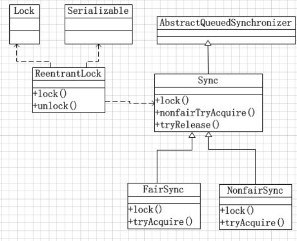
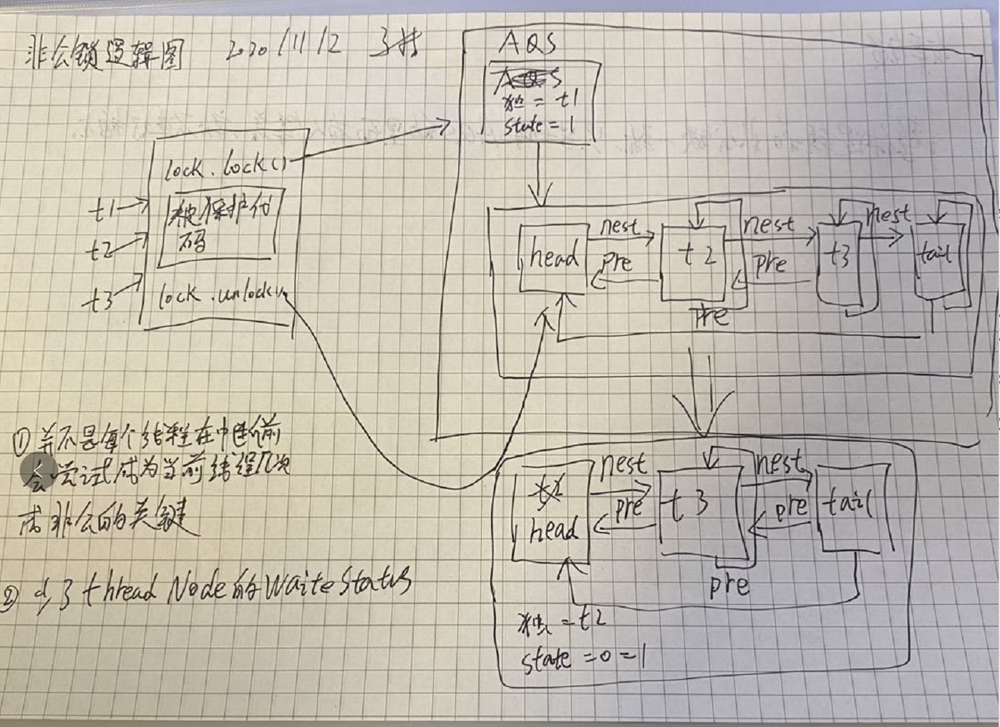

# J.U.C简介

​		`java.util.concurrent`是在并发编程中比较常用的工具类，里面包含很多用来在并发场景中使用的组件。比如线程池、阻塞队列、计时器、同步器、并发集合等等。并发包的作者是大名鼎鼎的Doug Lea。

# Lock

​		Lock在J.U.C中是最核心的组件。同synchronized一样是解决并发安全问题的一种手段。

## Lock简介

​		在Lock接口出现之前，Java中的应用程序对于多线程的并发安全处理只能基于synchronized关键字来解决。但是synchronized在有些场景中会存在一些短板，也就是它并不适合于所有的并发场景。但是在Java 5以后，Lock的出现可以解决synchronized在某些场景中的短板，它比synchronized更加灵活。

## Lock的实现

​		Lock本质上是一个接口，它定义了释放锁和获得锁的抽象方法，定义成接口就意味着它定义了锁的一个标准规范，也同时意味着锁的不同实现。实现Lock接口的类有很多，以下为几个常见的实现

- `ReentrantLock`：重入锁，重入锁指的是线程在获得锁之后，再次获取该锁不需要阻塞，而是直接关联一次计数器增加重入次数。
- `ReetrantReadWriteLock`：重入读写锁，它实现了`ReadWriteLock`接口，在这个类中维护了两把锁，一个是`ReadLock`另一个是`WriteLock`，它们都分别实现了Lock接口。读写锁是一种适合读多写少的场景下解决线程安全问题的工具，基本原则：读和写互斥、写和写互斥。也就是说涉及到影响数据变化的操作都会存在互斥。
- `StampedLock`：`StampedLock`是JDK 8引入的新的锁机制，可以简单认为是读写锁的一个改进版本，读写锁虽然通过分离读和写的功能使得读和读之间可以完全并发，但是读和写是有冲突的，如果大量的读线程存在，可能会引起线程饥饿。`StampedLock`是一种乐观的读策略，使用乐观锁完全不会阻塞写线程。

## Lock的类关系图



- `lock()`：如果锁可用就获得锁，如果锁不可用就阻塞直到锁释放。
- `lockInterruptibly()`：和`lock()`方法相似，但阻塞的线程可中断，抛出`java.lang.InterruptedException`。
- `tryLock()`：非阻塞获取锁，尝试获取锁如果成功返回true。
- `tryLock(long timeout, TimeUnit timeUnit)`：`tryLock()`基础上增加超时时间。
- `unlock()`：释放锁。

# `ReentrantLock`

​		重入锁，表示支持重新进入的锁，也就是说，如果当前`t1`通过调用`lock()`获取了锁之后，再次调用`lock()`，是不会再阻塞线程去获取锁的，直接增加重入次数就行了。synchronized和`ReentrantLock`都是可重入锁。很多同学不理解为什么锁会存在重入的特性，那是因为对于同步锁的理解程度还不够，比如在下面这类的场景中，存在多个加锁的方法相互调用，其实就是一种重入特性的场景。

## 重入锁的设计目的

​		比如调用`demo()`获得了当前的对象锁，然后在这个方法中再去调用`demo2()`，`demo2()`中存在同一个实例锁，这个时候当前线程会因为无法获得`demo2()`的对象锁而阻塞，就会产生死锁。重入锁的设计目的是避免线程的死锁。

```java
public class ReentrantDemo{
    public synchronized void demo(){
    System.out.println("begin:demo");
    demo2();
}
public void demo2(){
    System.out.println("begin:demo1");
    synchronized (this){
    }
}
public static void main(String[] args) {
    ReentrantDemo rd=new ReentrantDemo();
    new Thread(rd::demo).start();
    }
}
```


## `ReentrantLock`的使用案例

```java
public class AtomicDemo {
    private static int count = 0;
    static Lock lock = new ReentrantLock();
    
    public static void inc() {
        lock.lock();
        try {
            Thread.sleep(1);
        } catch (InterruptedException e) {
            e.printStackTrace()
        }
        count++;
        lock.unlock();
    }
    
    public static void main(String[] args) throws InterruptedException {
        for (int i = 0; i<1000; i++) {
            new Thread(()->{AtomicDemo.inc();}).start();
        }
        Thread.sleep(3000);
        System.out.println("result:" + count);
    }
}
```


## `ReentrantReadWriteLock`

​		我们以前理解的锁，基本都是排他锁，也就是这些锁是在同一时刻只允许一个线程进行访问，而读写锁在同一时刻可以允许多个线程访问，但是在写线程访问时，所有的读线程和其他写线程都会被阻塞。读写锁维护了一对锁，读锁和写锁。一般情况下，读写锁的性能都会比排他锁好，因为大多数场景读是多余写的。在读多于写的情况下，读写锁能够提供比排他锁更好的并发性和吞吐量。

```java
public class LockDemo {
    static Map<String, Object> cacheMap = new HashMap<>();
    static ReentrantReadWriteLock rwl = new ReentrantReadWriteLock();
    static Lock read = rwl.readLock();
    static Lock write = rwl.writeLock();
    
    public static final Object get(String key) {
        System.out.println("开始读取数据");
        read.lock();	// 读锁
        try {
            return cacheMap.get(key);
        } finally {
            read.unlock();
        }
    }
    
    public static final Object put(String key, String value) {
        write.lock();
        System.out.println("开始写数据");
        try {
            return cacheMap.put(key, value);
        } finally {
            write.unlock();
        }
    }
}
```

​		在这个案例中，通过`HashMap`来模拟了一个内存缓存，然后使用读写锁来保证这个内存缓存的线程安全性。当执行读操作的时候，需要获取读锁，在并发访问的时候，读锁不会被阻塞，因为读操作不会影响执行结果。

​		在执行写操作时，线程必须要获取写锁，当已经有线程持有写锁的情况下，当前线程会被阻塞，只有当写锁释放以后，其他读写操作才能继续执行。使用读写锁提升读操作的并发性，也保证每次写操作对所有的读写操作的可见性。

- 读锁与读锁可以共享
- 读锁与写锁不可以共享（排他）
- 写锁与写锁不可以共享（排他）


# `ReentrantLcok`的实现原理

​		我们知道锁的基本原理，是基于多线程并发任务通过某一种机制实现线程的串行执行，从而达到线程安全性的目的。在synchronized中，我们分析了偏向锁、轻量级锁、乐观锁。基于乐观锁以及自旋锁来优化了synchronized的加锁开销，同时在重量级锁阶段，通过线程的阻塞以及唤醒来达到线程竞争和同步的目的。那么在`ReentrantLock`中，也一定会存在这样需要去解决的问题。就是在多线程竞争重入锁时，竞争失败的线程是如何实现阻塞以及被唤醒的呢？

## `AQS`是什么

​		在Lock中，用到了一个同步队列AQS，全称`AbstractQueuedSynchronizer`，它是一个同步工具也是Lock用来实现线程同步的核心组件。如果你搞懂了AQS，那么`J.U.C`中绝大部分的工具都能轻松掌握。

## `AQS`的两种功能

​		从使用层面来说，`AQS`的功能分为两种：独占和共享。

​		独占锁，每次只能有一个线程持有锁，比如前面的`ReentrantLock`就是独占方式实现的互斥锁。

​		共享锁，允许多个线程同时获取锁，并发访问共享资源，比如`ReentrantReadWriteLock`。

## `AQS`的内部实现

​		细节太多，直接整个逻辑图。来搞定`非公锁`因为`公平锁`也大同小异。





# 疑问

[重入锁设计目的这个demo太坑了](#重入锁的设计目的)

[实例锁和对象锁](#重入锁的设计目的)