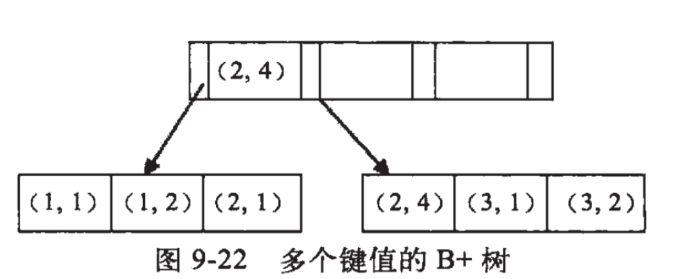

# Java

## Container

java中经常问到的就是线性结构和离散结构的问题。

### ArrayList和LinkedList的差异

ArrayList使用数组作为数据存储容器，LinkedList使用双向链表作为数据存储容器。

| 操作 | ArrayList                                                    | LinkedList         |
| ---- | ------------------------------------------------------------ | ------------------ |
| 创建 | 一次性申请数组长度的定额内存                                 | 不申请额外内存     |
| 插入 | 根据下标存入数组，数组没有越界就不会有额外操作，如果越界就会触发扩容。 | 关联元素即可       |
| 删除 | 根据下标清除，根据对象清除(这个特别蠢因为会循环查找)。会涉及拷贝。 | 循环查找然后unlink |
| 查询 | 通过下标直接命中，通过对象就有点蠢和LinkedList一样。         | 循环查找           |

> 总结：插入链表占优势，查询数组(使用下标的情况下)占优势。
>
> 删除如果ArrayList使用下标清除和LinkedList应该是五五开。因为一个避免了循环一个避免了拷贝。


### HashMap

HahsMap使用散列表实现。

> 重要参数 DEFAULT_INITIAL_CAPACITY(默认初始容量默认16)、DEFAULT_LOAD_FACTOR(负载因子默认0.75)

| 操作 | HashMap                                             | 其他                                 |
| ---- | --------------------------------------------------- | ------------------------------------ |
| 创建 | 创建数组，数组每个元素挂一个容器(默认是链表)        |                                      |
| 插入 | 对key进行hash运算取模命中数组下标。将KV加入到链表。 | 根据负载因子计算容量比例决定**扩容** |
| 删除 | 对key进行hash运算取模命中数组下标。将KV从链表删除。 | 根据负载因子计算容量比例决定**缩容** |
| 查询 | 对key进行hash运算取模命中数组下标。将KV从链表返回。 |                                      |

> 注意事项：有效使用HashMap需要注意数据规模合理设置DEFAULT_INITIAL_CAPACITY防止桶过大的情况。避免大量插入导致的扩容操作。

**HashMap 1.8的改进**

参数: TREEIFY_THRESHOLD(树化阈值=8)，UNTREEIFY_THRESHOLD(取消树化阈值=6)，MIN_TREEIFY_CAPACITY(最小的树化容量=64)

主要是为了优化链表的查询时间复杂度是N，使用树结构优化为NlgN。

> 但是这个优化仅存在于查询，因为HashMap引用的是红黑树，在不断插入和删除时的树平衡也是额外的开销。(但是相对的数据量够大(数组够长)那么红黑树也会够多每次受到影响的也是一小部分红黑树，这受益于散列表的这个结构优势。)


### HashSet

HashSet实际是一个HashMap的实例，都是一个存放链表的数组。它不保证存储元素的迭代顺序。HashSet所有元素都存在Key上Value是一个的对象。

- Hash不允许有null元素
- HashSet不允许有重复元素，因为HashSet是基于HashMap实现的。


### Iterator迭代器

​		Iterator对象成为迭代器(设计模式的一种)，迭代器可以对集合进行遍历，但每一个集合内部的数据结构可能是不尽相同的，所以每一个集合存和取都很可能是不一样的，虽然我们可以人为地在每一个类中定义hashNext()和next()方法，但这样做会让整个集合体系过于臃肿。于是就有了迭代器。

​		迭代器是将这样的方法抽取出接口，然后在每个类的内部，定义自己迭代方法，这样做就规定了整个集合系统的遍历方式都是hashNext和next()方法，使用者不用管怎么实现的，会用即可。迭代器的定义为：提供一种方法访问一个容器对象中各个元素，而又不需要暴露该对象的内部细节。


**迭代器有啥用？**

​		Iterator主要是用来遍历集合用的，它的特点是更加安全，因为它可以确保，在当前遍历的集合元素被更改的时候，就会抛出`ConcurrentModificationException`异常。


### 线程安全的容器


| 不安全     | 安全                  | 说明                                                         |
| ---------- | --------------------- | ------------------------------------------------------------ |
| ArrayList  | CopyOnWriteArrayList  | 读多写少的场合性能非常好，远远好于Vector                     |
| HashMap    | ConcurrentHashMap     | 线程安全的HashMap                                            |
| LinkedList | ConcurrentLinkedQueue | 高效的并发队列，使用链表实现。这是一个非阻塞的队列           |
|            | BlockingQueue         | 这是一个接口，JDK内部通过链表、数组等方式实现了这个接口。表示阻塞队列，非常适合用于数据共享的通道。 |
|            | ConcurrentSkipListMap | 跳表实现。使用跳表进行快速查找。                             |


### ConcurrentHashMap和Hashtable的区别

ConcurrentHashMap和Hashtable的区别主要体现在实现线程安全的方式不同

- **底层数据结构**：JDK1.7的ConcurrentHashMap底层采用**分段的数组+链表**实现，JDK1.8采用的数据结构和HashMap 1.8的结构一样，数组+链表/红黑树。Hashtable和JDK1.8之前的HashMap的底层数据结构类似都是采用**数组+链表**的形式，数组是HashMap的主体，链表则是为了解决哈希冲突而存在的。
- **实现线程安全的方式(重要)**
  - **在JDK1.7的时候，ConcurrentHashMap(分段锁)**对整个数组进行了分割分段(Segment)，每一把锁只锁容器其中一部分数据，多线程访问容器里不同数据段的数据，就不会存在锁竞争，提高并发访问率。到了**JDK1.8的时候已经摒弃了Segment的概念，而是直接用Node数组+链表+红黑树的数据结构来实现，并发控制使用synchronized和CAS来操作(JDK1.6以后对synchronized做了很多优化)**整体看起来就像是优化过且线程安全的HashMap，虽然在JDK1.8中还能看到Segment的数据结构，但是已经简化了属性，只是为了兼容旧版本。
  - **Hashtable(同一把锁)**：使用synchronized来保证线程安全，效率低下。当一个线程访问同步方法时，其他线程也访问同步方法，可能会进入阻塞或轮询状态，如使用put添加元素，另一个线程不能使用put添加元素，也不能使用get，竞争会越来越激烈。

## Thread

### 线程生命周期

NEW、RUNNABLE、WAITING、WAITING_TIME、BLOCKED、TERMINATED

### 关键字

**synchronized**: Java提供的互斥锁。会在指令集层面为代码添加monitorenter和monitorexite。

> 1.6 中 synchronized 引入锁升级概念：偏向锁(假设只有一个线程)-->轻量级锁(少量线程短时间)-->重量级锁(多线程竞争严重)
>
> 锁信息存储在对象头中。

**volatile**: 读取被volatile修饰的变量时，会将这个变量的值同步到其他cpu的高速缓存中。


### 死锁

多个线程同时被阻塞，它们中的一个或者全部在等待某个资源的释放。

```java
private static Object resource1 = new Object();
private static Object resource2 = new Object();

public static void method1() {
    synchronized(resource1) {
        // 一顿处理
        synchronized(resource2) {
            // 一顿处理
        }
    }
}

public static void method2() {
    synchronized(resource2) {
        // 一顿处理
        synchronized(resource1) {
            // 一顿处理
        }
    }
}
```

**解决死锁**

首先要了解死锁产生的条件。操作系统产生死锁必须具备以下四个条件

1. 互斥条件：该资源任意时刻只由一个线程占用。
2. 请求与保持条件：一个进程因请求资源被阻塞时，对已获得的资源保持不放。
3. 不剥夺条件：线程已获得的资源在未使用之前不能被其他线程强行剥夺，只有自己使用完毕后才释放资源。
4. 循环等待条件：若干进程之间形成一种头尾相接的循环等待资源关系。

主要破坏4种条件其中一个就可以

1. 破坏互斥条件：这个无法破坏，因为使用锁就是想要多个线程互斥。
2. 破坏请求与保持条件：一次性申请所有资源。
3. 破坏不剥夺条件：占用部分资源的线程进一步申请其他资源时，如果申请不到，可以主动释放它占有的资源。(**超时机制**)
4. 破坏循环等待条件：按序申请资源预防。按某一顺序申请资源，释放资源则反序释放(**队列机制**)。

> 最容易的是添加超时和队列机制。


### synchronized和ReentrantLock区别

**两者都是可重入锁**

**“可重入锁”**指的是自己可以再次获取自己的内部锁。比如一个线程获得了某个对象的锁，此时这个对象锁还没有释放，当其再次想要获取这个对象的时候还是可以获取的，如果不可锁重入的话，就会造成死锁。同一个线程每次获取锁，锁的计数器都自增1，所以要等到锁的计数器下降为0时才能释放锁。


**synchronized依赖于JVM而ReentrantLock依赖于API**

synchronized是依赖于JVM实现的，虽然Jsynchronized进行了很多优化，但是这些优化都是在虚拟机层面实现的，并没有直接暴露给我们。ReentrantLock是JDK层面实现的(也就是API层面，需要lock()和unlock()方法配合try/catch/finally语句块来完成)，所以我们可以通过查看它们的源代码，来看它是如何实现的。


**ReentrantLock比synchronized增加了一些高级功能**

- 等待可中断：lock.lockInterruptibly()来实现这个机制。也就是说正在等待的线程可以选择放弃等待，改为处理其他事情。
- 可实现公平锁：synchronized是非公平锁实现，ReentrantLock默认也是非公平锁实现，但是可以通过ReentrantLock(boolean fair)使用公平锁。
- 可实现选择通知（锁可以绑定多个条件）：synchronized与wait()和notify()可以实现等待/通知机制。ReentrantLock借助Condition接口和newCondition()方法实现。

> synchronized相当于当前JVM下所有线程公用一个Condition当调用notifyAll()时会通知所有线程。Condition的signalAll()只会唤醒注册在该Condition实例中的所有线程。

**如果你想使用上述功能，那么ReentrantLock是一个不错的选择。性能已不是选择标准。**


### ThreadLocal

​		通常情况下，我们创建的变量是可以被任何一个线程访问并修改的。**如果想实现每一个线程都有自己的专属本地变量该如何解决呢？**JDK中提供的ThreadLocal类正是为了解决这样的问题。**ThreadLocal类主要解决的就是让每个线程绑定自己的值，可以将ThreadLocal类形象的比喻成存放数据的盒子，盒子中可以存储每个线程的私有数据。**

​		**如果你创建了一个ThreadLocal变量，那么访问这个变量的每个线程都会有这个变量的本地副本，这也是ThreadLocal类名的由来。它们可以使用get()和set()方法来获取默认值或将其更改为当前线程所存的副本值，从而避免了线程安全问题。**


### 线程池

**为什么要使用线程池？**

> 池化技术想必大家已经屡见不鲜了，线程池、数据库连接池、Http连接池等等都是对这个思想的应用。池化技术的思想主要是为了减少每次获取资源的消耗，提高对资源的利用率。

**使用线程池的好处**

1. **降低资源消耗**。通过重复利用已创建的线程降低线程创建和销毁造成的消耗。
2. **提高响应速度**。当任务到达时，任务可以不需要等待线程创建就能立即执行。
3. **提高线程的可管理性**。线程是稀缺资源，如果无限制的创建，不仅会消耗系统资源，还会降低系统的稳定性，使用线程池可以进行统一的分配、调优和监控。


### 如何创建线程池

《阿里巴巴Java开发手册》中强制线程池不允许使用Executors去创建，而是通过ThreadPoolExecutor的构造器，这样的处理方式让开发更加明确线程池的运行规则，避免资源耗尽的风险

> Executors返回线程池对象的弊端如下
>
> - FixedThreadPool和SingletonThreadExecutor：允许请求的队列长度为Integer.MAX_VALUE，可能会**堆积**大量的请求，从而导致OOM。
> - CacheThreadPool和ScheduledThreadPool：允许创建的线程数量为Integer.MAX_VALUE，可能会**创建**大量线程，从而导致OOM。


- 通过Executors工具类的方法`SingletonThreadExecutor`、`FixedThreadPool`、`CacheThreadPool`等
- 通过ThreadPoolExecutor的构造方法创建


### ThreadPoolExecutor

| 名称            | 说明                                                         |
| --------------- | ------------------------------------------------------------ |
| corePoolSize    | 核心线程数定义了最小可以同时运行的线程数量。                 |
| maxinumPoolSize | 当队列中存放的任务达到队列容量的时候，当前可以同时运行的线程数量变为最大线程数。 |
| workQueue       | 当新任务来的时候会先判断当前运行的线程数量是否达到核心线程数，如果达到的话，新任务就会存放在队列中。 |
| keepAliveTime   | 当线程池中的线程数量大于corePoolSize的时候，如果这时没有新的任务提交，核心线程外的线程不会立即销毁，而是会等待，直到超过keepAliveTime才会被销毁。 |
| unit            | keepAliveTime的时间单位。                                    |
| threadFactory   | executor创建新线程的时候会用到。                             |
| handler         | 饱和策略。                                                   |


**ThreadPoolExecutor饱和策略**

如果当前同时运行的线程数量达到最大线程数并且队列已经被放满了时，`ThreadPoolExecutor`定义了一些策略

| 策略                                   | 说明                                                         |
| -------------------------------------- | ------------------------------------------------------------ |
| ThreadPoolExecutor.AbortPolicy         | 抛出RejectedExecutionException来拒绝新任务的处理。           |
| ThreadPoolExecutor.CallerRunsPolicy    | 调用执行自己的线程运行任务，也就是直接在调用execute方法的线程中运行(run)被拒绝的任务，如果执行程序已关闭，则会丢弃该任务。因此这种策略会降低对于新任务提交速度，影响程序的整体性能。如果您的应用程序可以承受此延迟并且你要求任何一个任务请求都要被执行的话话，你可以选择这个策略。 |
| ThreadPoolExecutor.DiscardPoliy        | 不处理新任务，直接丢弃掉。                                   |
| ThreadPoolExecutor.DiscardOldestPolicy | 丢弃最早的未处理的任务。                                     |

> 举个例子：Spring通过`ThreadPoolTaskExecutor`或者我们直接通过`ThreadPoolExecutor`的构造函数创建线程的时候，当我们不指定`RejectedExecutionHandler`饱和策略来配置线程池的时候默认使用的ThreadPoolExecutor.AbortPolicy。默认情况下，ThreadPoolExecutor将抛出RejectedExecutionException来拒绝新任务，这代表你将丢失对这个任务的处理。对于可伸缩的应用程序，建议使用ThreadPoolExecutor.CallerRunsPolicy。当最大池被填满时，此策略为我们提供可伸缩队列。

### AtomicInteger类的原理

AtomicInteger类主要利用CAS(compare and swap)+volatile和native方法来保证原子操作，从而避免synchronized的高开销，执行效率大为提升。

CAS的原理是那期望值和原本值做比较，如果相关则更新成最新值。UnSafe类objectFieldOffset()是一个本地方法，这个方法用来拿到“原来的值”的内存地址，返回值是valueOffset。另外value是一个volatile变量，在内存中可见，因此JVM可以保证任何时刻任何线程总能拿到该变量的最新值。

## IO


# J2EE Framework

## Spring

### IoC初始化过程

XML-->Resource-->BeanDefinition-->BeanFactory

### Bean的作用域

| 作用域         | 说明                                                         |
| -------------- | ------------------------------------------------------------ |
| singleton      | 唯一bean实例，Spring中的bean默认都是singleton。              |
| prototype      | 每次请求都会创建一个新的bean。                               |
| request        | 每一次http请求都会产生一个新的bean，该bean只在这次http request中生效。 |
| session        | 每一次http请求都会产生一个新的bean，该bean只在这次http session中生效。 |
| global-session | 全局session作用域。                                          |

### Bean线程安全问题

单例bean存在线程安全问题，是因为当多个线程操作同一个对象的时候，对这个对象的非静态成员变量的写操作会存在线程安全问题。

常见的有两种解决办法

1. Bean对象中尽量避免定义可变的成员变量(不现实)。
2. 在类中定义一个ThrealLocal成员变量，将需要的可变成员变量保存在ThreadLocal中(推荐)。

### Bean生命周期

1. 实例化bean对象
2. 设置对象属性
3. 检查Aware相关接口并设置相关依赖
4. BeanPostPrecessor前置处理
5. 检查是否是InitializingBean以绝对是否调用afterPropertiesSet方法
6. 检查是否配置有自定义的init-method
7. BeanPostPorcessor后置处理
8. 注册必要的Destruction相关回调接口
9. **使用中**
10. 是否实现DisposableBean接口
11. 是否配置有自定义的destroy方法

### Bean循环依赖

Bean 实例化主要分为3步

1. createBeanInstance实例化
2. populateBean填充属性
3. InitializeBean初始化

> 问题出现在：第一步和第二步的过程中。如果不做处理就会出现先有鸡还是先有蛋的问题。

**Spring如何解决**

- Spring在发现循环依赖的时候使用三级缓存解决

```java
// 一级缓存：用于存放完全初始化好的bean
Map<String, Object> singletonObjects;
// 二级缓存：存放原始的bean对象(尚未填充属性)，用于解决循环依赖
Map<String, Object> earlySingletonObjects;
// 三级缓存：存放bean工厂对象，用于解决循环依赖
Map<String, Object> singletonFactories;

// bean的获取过程：先从一级获取，失败再从二级获取，失败再从三级获取
// 创建中状态：是指对象已经new出来了但是所有属性均为null等待被init
```

检测循环依赖的过程如下

- A创建过程中需要B，于是**A将自己放在三级缓存里面**，去实例化B
- B实例化的时候发现需要A，于是B先查一级缓存，没有，再查二级缓存，还是没有，再查三级缓存，找到了！
  - **然后把三级缓存里面的这个A放到二级缓存里面，并删除三级缓存里面的A**
  - B顺利实例化完毕，**将自己放到一级缓存里面**(此时B里面的A依然是创建中状态)
- 然后回来接着创建A，此时B已经创建结束，直接从一级缓存里面拿到B，然后完成创建，并将自己放到一级缓存里面。


> 总结：先让最底层对象完成初始化，通过三级缓存与二级缓存提前曝光创建中的bean，让其他Bean率先完成初始化。


> Spring还是有一些无法解决的循环依赖，需要我们写代码时注意，例如：**使用构造器注入其他Bean的实例**，这个就没办法了。要手动改代码。

### Spring AOP


### Spring 事务

> 再次提醒：你的程序是否支持事务首先取决于数据库，比如使用MySQL的话，如果你选择的是innodb引擎，那么恭喜你，是可以支持事务的。但是，如果你的MySQL数据库使用的myisam引擎的话，那不好意思，从根本上就是不支持事务的。

​		我们知道如果想要保证事务的原子性，就需要在异常发生时，对已经执行的操作进行**回滚**，在MySQL中，恢复机制是通过**回滚日志(undolog)**实现的，所有的事务进行的修改都会先记录到这个回滚日志中，然后再执行相关的操作。如果执行过程中遇到异常的话，我们直接利用**回滚日志**中的信息将数据回滚到修改之前的样子即可！并且，回滚日志会先于数据持久化到磁盘上。这样就保证了即使遇到数据库突然宕机等情况，当用户再次启动数据库的时候，数据库还能够通过查询日志来回滚之前未完成的事务。


**Spring支持两种方式的事务管理**

1. 编程式事务管理
2. 声明式事务管理

#### 编程式事务管理

通过TransactionTemplate或者TransactionManager手动管理事务，实际应用中很少使用，但是有助于理解Spring事务管理原理。

使用TransactionTemplate进行编程式事务管理的示例

```java
@Autowired
private TransactionTemplate transactionTemplate;

public void testTransaction() {
    transactionTemplate.execute(new TransactionCallbackWithoutResult() {
       @Override
       protected void doInTransactionWithoutResult(TransactionStatus transactionStatus) {
           try {
               // 业务代码
           } catch (Exception e) {
               // 回滚
               transactionStatus.setRollbackOnly();
           }
       }
    });
}
```

使用TransactionManager进行编程式事务管理的示例

```java
@Autowired
private PlatformTransactionManager transactionManager;

public void testTransaction () {
    TransactionStatus status = transactionManager.getTransaction(new DefaultTransactionDefinition());
    try {
        // 业务代码
        transactionManager.commit(status);
    } catch (Exception e) {
        transactionManager.rollback(status);
    }
}
```

#### 声明式事务管理

推荐使用（代码侵入性最小），实际是通过AOP实现(基于@Transactional的全注解方式使用最多)。

使用@Transactional注解进行事务管理的示例

```java
@Transactional(propagation=propagation.PROPAGATION_REQUIRED)
public void aMethod() {
    // do something
    B b = new B();
    C c = new C();
    b.bMethod();
    c.cMethod();
}
```


#### Spring 事务管理接口

Spring框架中，事务管理相关最重要的3个接口如下

- PlatformTransactionManager：（平台）事务管理器，Spring事务策略的核心。
- TransactionDefinition：事务定义信息（事务隔离级别、传播行为、超时、只读、回滚规则）。
- TransactionStatus：事务运行状态。


我们可以把PlatformTransactionManager接口可以被看作是事务上层的管理者，而TransactionDefinition和TransactionStatus这两个接口可以看作是事务的描述。


#### PlatformTransactionManager：事务管理接口

**Spring并不直接管理事务，而是提供了多种事务管理器。**Spring事务管理器的接口是：PlatformTransactionManager。

通过这个接口，Spring为各个平台如JDBC(DataSourceTransactionManager)、Hibernate(HibernateTransactionManager)、JPA(JpaTransactionManager)等都提供了对于的事务管理器，但是具体的实现就是各个平台自己的事情了。


#### TransactionDefinition：事务属性

事务管理器接口PlatformTransactionManager通过getTransaction(TransactionDefinition definition)方法来得到一个事务，这个方法形参类型TransactionDefinition，这个类就定义了一些基本的事务属性。

那什么是**事务属性**呢？

事务属性可以理解成事务的一些基本配置，描述了事务策略如何应用到方法上。

事务属性包含了5个方面：

```java
package org.springframework.transaction;

import org.springframework.lang.Nullable;

public interface TransactionDefinition {
    int PROPAGATION_REQUIRED = 0;
    int PROPAGATION_SUPPORTS = 1;
    int PROPAGATION_MANDATORY = 2;
    int PROPAGATION_REQUIRES_NEW = 3;
    int PROPAGATION_NOT_SUPPORTED = 4;
    int PROPAGATION_NEVER = 5;
    int PROPAGATION_NESTED = 6;
    int ISOLATION_DEFAULT = -1;
    int ISOLATION_READ_UNCOMMITTED = 1;
    int ISOLATION_READ_COMMITTED = 2;
    int ISOLATION_REPEATABLE_READ = 4;
    int ISOLATION_SERIALIZABLE = 8;
    int TIMEOUT_DEFAULT = -1;
    // 返回事务的传播行为，默认值为 REQUIRED。
    int getPropagationBehavior();
    //返回事务的隔离级别，默认值是 DEFAULT
    int getIsolationLevel();
    // 返回事务的超时时间，默认值为-1。如果超过该时间限制但事务还没有完成，则自动回滚事务。
    int getTimeout();
    // 返回是否为只读事务，默认值为 false
    boolean isReadOnly();

    @Nullable
    String getName();
}
```


#### TransactionStatus：事务状态

TransactionStatus接口用来记录事务的状态，该接口定义了一组方法，用来获取或判断事务的相应状态信息。

PlatformTransactionManager.getTransaction(...)返回一个TransactionStatus对象

```java
public interface TransactionStatus{
    boolean isNewTransaction(); // 是否是新的事物
    boolean hasSavepoint(); // 是否有恢复点
    void setRollbackOnly();  // 设置为只回滚
    boolean isRollbackOnly(); // 是否为只回滚
    boolean isCompleted; // 是否已完成
}
```


### Spring事务属性详解

实际业务开发中，大家一般都是使用@Transactional注解来开启事务，很多人并不清楚这个参数里面的参数是什么意思，有什么用。为了更好的在项目中使用事务管理，强烈推荐好好阅读一下下面的内容。


#### 事务传播行为

当事务方法被另一个事务方法调用时，必须制定事务应该如何传播。例如：方法可能继续在现有事务中运行，也可能开启一个新事务，并在自己的事务中运行。


**举个例子!**

我们在A类的aMethod()方法中调用了B类的bMethod()方法。这个时候就涉及到业务层方法之间互相调用的事务问题。如果我们的bMethod()如果发生异常需要回滚，如何配置事务传播行为才能让aMethod()也跟着回滚呢？这个时候就需要事务传播行为的知识了。

```java
Class A {
    @Transactional(propagation=propagation.xxx)
    public void aMethod {
        //do something
        B b = new B();
        b.bMethod();
    }
}

Class B {
    @Transactional(propagation=propagation.xxx)
    public void bMethod {
       //do something
    }
}
```

在TransactionDefinition定义中包括了如下几个表示传播行为的常量

```java
public interface TransactionDefinition {
    int PROPAGATION_REQUIRED = 0;
    int PROPAGATION_SUPPORTS = 1;
    int PROPAGATION_MANDATORY = 2;
    int PROPAGATION_REQUIRES_NEW = 3;
    int PROPAGATION_NOT_SUPPORTED = 4;
    int PROPAGATION_NEVER = 5;
    int PROPAGATION_NESTED = 6;
}
```

不过如此，为了方便使用，Spring会相应地定义了一个枚举类：Propagation

```java
package org.springframework.transaction.annotation;

import org.springframework.transaction.TransactionDefinition;

public enum Propagation {

	REQUIRED(TransactionDefinition.PROPAGATION_REQUIRED),

	SUPPORTS(TransactionDefinition.PROPAGATION_SUPPORTS),

	MANDATORY(TransactionDefinition.PROPAGATION_MANDATORY),

	REQUIRES_NEW(TransactionDefinition.PROPAGATION_REQUIRES_NEW),

	NOT_SUPPORTED(TransactionDefinition.PROPAGATION_NOT_SUPPORTED),

	NEVER(TransactionDefinition.PROPAGATION_NEVER),

	NESTED(TransactionDefinition.PROPAGATION_NESTED);


	private final int value;

	Propagation(int value) {
		this.value = value;
	}

	public int value() {
		return this.value;
	}

}
```

##### TransactionDefinition.PROPAGATION_REQUIRED

使用的最多的一个事务传播行为，我们平时经常使用的@Transactional注解默认使用就是这个事务传播行为。如果当前存在事务，则加入该事务；如果当前没有事务，则创建一个新的事务。也就是说：

1. 如果外部方法没有开启事务的话，propagation.REQUIRED修饰的内部方法会新开启自己的事务，且开启的事务相互独立，互不干挠。
2. 如果外部方法开启事务并且设置propagation.REQUIRED的话，所有PROPAGATION_REQUIRED修饰的内部方法和外部方法均属于同一事务，只要一个方法回滚，整个事务回滚。

举个例子：如果我们上面的aMethod()和bMethod()使用的都是propagation.REQUIRED传播行为的话，两者使用的就是同一个事务，只要其中一个方法回滚，整个事务回滚。

```java
Class A {
    @Transactional(propagation=propagation.REQUIRED)
    public void aMethod {
        //do something
        B b = new B();
        b.bMethod();
    }
}

Class B {
    @Transactional(propagation=propagation.REQUIRED)
    public void bMethod {
       //do something
    }
}
```

##### TransactionDefinition.PROPAGATION_REQUIRES_NEW

创建一个新的事务，如果当前存在事务，则把当前事务挂起。也就是说不管外部方法是否开启事务，propagation.REQUIRES_NEW修饰的内部方法会新开启自己的事务，且开启的事务相互独立，互不干扰。

举个例子：如果我们上面的bMethod()和使用propagation.REQUIRES_NEW事务传播行为修饰，aMethod还是使用propagation.REQUIRED修饰的话。如果aMethod()发生异常回滚，bMethod()不会跟着回滚，因为bMethod()开启了独立的事务。但是，如果bMethod()抛出了未被捕获的异常并且这个异常满足事务回滚规则的话，aMethod()同样也会回滚，因为这个异常被aMethod()的事务管理机制检测到了。

```java
Class A {
    @Transactional(propagation=propagation.PROPAGATION_REQUIRED)
    public void aMethod {
        //do something
        B b = new B();
        b.bMethod();
    }
}

Class B {
    @Transactional(propagation=propagation.REQUIRES_NEW)
    public void bMethod {
       //do something
    }
}
```

##### TransactionDefinition.PROPAGATION_NESTED

如果当前存在事务，则创建一个事务作为当前事务的嵌套事务来运行；如果当前没有事务，则该取值等价于TransactionDefinition.PROPAGATION_REQUIRED。也就是说：

1. 在外部方法未开启事务的情况下Propagation.NESTED和Propagation.REQUIRED作用相同，修饰的内部方法都会新开启自己的事务，且开启的事务相互独立，互补干扰。
2. 如果外部方法开启事务的话，Propagation.NESTED修饰的内部方法属于外部事务的子事务，外部事务回滚的话，子事务也会回滚，而内部子事务可以单独回滚而不影响外部主事务和其他子事务。

这里还是简单举个例子

如果aMethod()回滚的话，bMethod()和bMethod2()都要回滚，而bMethod()回滚的话，并不会造成aMethod()和bMethod2()回滚。

```java
Class A {
    @Transactional(propagation=propagation.PROPAGATION_REQUIRED)
    public void aMethod {
        //do something
        B b = new B();
        b.bMethod();
        b.bMethod2();
    }
}

Class B {
    @Transactional(propagation=propagation.PROPAGATION_NESTED)
    public void bMethod {
       //do something
    }
    @Transactional(propagation=propagation.PROPAGATION_NESTED)
    public void bMethod2 {
       //do something
    }
}
```


##### 比较少用的传播机制

- TransactionDefinition.PROPAGATION_SUPPORTS：如果当前存在事务，则加入该事务；如果当前没有事务，则以非事务的方式继续运行。
- TransactionDefinition.PROPAGATION_NOT_SUPPORTS：以非事务方式运行，如果当前存在事务，则把当前事务挂起。
- TransactionDefinition.PROPAGATION_NEVER：以非事务方式运行，如果当前存在事务，则抛出异常。
- TransactionDefinition.PROPAGATION_MANDATORY：如果当前存在事务，则加入该事务；如果当前没有事务，则抛出异常。(mandatory：强制性)


#### 事务隔离机制

TransactionDifinition接口中定义了五个表示隔离级别的常量

```java
public interface TransactionDefinition {
    ......
    int ISOLATION_DEFAULT = -1;
    int ISOLATION_READ_UNCOMMITTED = 1;
    int ISOLATION_READ_COMMITTED = 2;
    int ISOLATION_REPEATABLE_READ = 4;
    int ISOLATION_SERIALIZABLE = 8;
    ......
}
```

和事务传播行为这块一样，为了方便使用，Spring也相应地定义了一个枚举类：Isolation

```java
public enum Isolation {

	DEFAULT(TransactionDefinition.ISOLATION_DEFAULT),

	READ_UNCOMMITTED(TransactionDefinition.ISOLATION_READ_UNCOMMITTED),

	READ_COMMITTED(TransactionDefinition.ISOLATION_READ_COMMITTED),

	REPEATABLE_READ(TransactionDefinition.ISOLATION_REPEATABLE_READ),

	SERIALIZABLE(TransactionDefinition.ISOLATION_SERIALIZABLE);

	private final int value;

	Isolation(int value) {
		this.value = value;
	}

	public int value() {
		return this.value;
	}

}
```

隔离级别介绍

- TransactionDefinition.ISOLATION_DEFAULT：使用后端数据库默认的隔离级别，MySQL默认采用REPEATABLE隔离级别Oracle默认采用READ_COMMITTED隔离界别。
- TransactionDefinition.ISOLATION_READ_UNCOMMITTED：最低的隔离级别，使用这个隔离级别的很少，因为它允许读取尚未提交的数据变更，**可能会导致脏读、幻读或不可重复读。**
- TransactionDefinition.ISOLATION_READ_COMMITTED：允许读取并发事务已经提交的数据，**可以阻止脏读，但是幻读或不可重复读仍有可能发生。**
- TransactionDefinition.ISOLATION_REPEATABLE_READ：对同一字段的多次读取结果都是一致的，除非数据是被本身事务自己所修改，**可以阻止脏读和不可重复读，但幻读仍有可能发生。**
- TransactionDefiniton.ISOLATION_SERIALIZABLE：最高的隔离级别，完全服从ACID的隔离级别。所有的事务依次逐个执行，这样事务之间就完全不可能产生干扰，也就是说，**该级别可以防止脏读、不可重复读以及幻读。**但是这将严重影响程序的性能。通常情况下也不会用到该级别。

| 名称                       | 说明                                                     |
| -------------------------- | -------------------------------------------------------- |
| 读未提交(Read Uncommitted) | 可以读取到未提交的内容。隔离性最差。                     |
| 读提交(Read Committed)     | 可以读取到提交的内容。SQL Server和Oracle的默认隔离级别。 |
| 可重复读(Repeated Read)    | 事务启动时就上行锁解决不可重复读，MySQL的默认隔离级别。  |
| 串行化(Serializable)       | 串行执行避免所有读取问题。                               |

读取说明

| 名称                          | 说明                                                         |
| ----------------------------- | ------------------------------------------------------------ |
| 脏读(dirty read)              | C事务未提交的情况下，O事务能够查询到。select                 |
| 不可重复读(unrepeatable read) | C事务在B事务更新一条的前后两次查询到的结果不一致。update     |
| 幻读(phantom problem)         | C事务在B事务新增或删除一条数据前后两次查询的结果不一致。insert delete |


### Spring Boot

### Spring MVC 

https://www.cnblogs.com/shamo89/p/9942315.html

## MyBatis


# Distributed

## CAP

CAP是Consistency(一致性)、Availability(可用性)、Partition Tolerance(分区容错性)的简写。


- Consistency: 所有节点访问同一份最新的数据副本。
- Availability: 非故障的节点在合理的时间内返回合理的响应。
- Partition Tolerance: 分布式系统出现网络分区故障上的时候，仍然能够对外提供服务。

> 注意C+P或A+P绝对完美实现。但是CA是悖论绝对实现不了。


## BASE

​		BASE理论解决CAP理论提出了分布式系统的Consistency和Availability不能兼容的问题，如果想全面的学习BASE原理，请参考[Eventual consistency](https://link.jianshu.com/?t=https://en.wikipedia.org/wiki/Eventual_consistency)。

- Basically Available：基本可用
- Soft State：软状态，状态可以有一段时间不同步
- Eventually Consistent：最终一致性，最终数据是一致的就可以了，而不是时时保持强一致

## Distributed Transaction

- X/Open DTP
- Tow Partition Commit
- Three Partition Commit
- TCC
- 查询模式+补偿模式
- 查询模式+异步确保模式+补偿模式
- 查询模式+定期校对模式+补偿模式


## Spring Cloud

https://www.cnblogs.com/aishangJava/p/11927311.html

# Middleware

## MySQL


### 最左匹配原则

> https://www.cnblogs.com/lanqi/p/10282279.html

1.简单说下什么是最左匹配原则
顾名思义：最左优先，以最左边的为起点任何连续的索引都能匹配上。同时遇到范围查询(>、<、between、like)就会停止匹配。
例如：b = 2 如果建立(a,b)顺序的索引，是匹配不到(a,b)索引的；但是如果查询条件是a = 1 and b = 2或者a=1(又或者是b = 2 and b = 1)就可以，因为优化器会自动调整a,b的顺序。再比如a = 1 and b = 2 and c > 3 and d = 4 如果建立(a,b,c,d)顺序的索引，d是用不到索引的，因为c字段是一个范围查询，它之后的字段会停止匹配。

2.最左匹配原则的原理
最左匹配原则都是针对联合索引来说的，所以我们有必要了解一下联合索引的原理。了解了联合索引，那么为什么会有最左匹配原则这种说法也就理解了。

我们都知道索引的底层是一颗B+树，那么联合索引当然还是一颗B+树，只不过联合索引的健值数量不是一个，而是多个。构建一颗B+树只能根据一个值来构建，因此数据库依据联合索引最左的字段来构建B+树。
例子：假如创建一个（a,b)的联合索引，那么它的索引树是这样的



可以看到a的值是有顺序的，1，1，2，2，3，3，而b的值是没有顺序的1，2，1，4，1，2。所以b = 2这种查询条件没有办法利用索引，因为联合索引首先是按a排序的，b是无序的。

同时我们还可以发现在a值相等的情况下，b值又是按顺序排列的，但是这种顺序是相对的。所以最左匹配原则遇上范围查询就会停止，剩下的字段都无法使用索引。例如a = 1 and b = 2 a,b字段都可以使用索引，因为在a值确定的情况下b是相对有序的，而a>1and b=2，a字段可以匹配上索引，但b值不可以，因为a的值是一个范围，在这个范围中b是无序的

## RabbitMQ

### 模型

> RabbitMQ服务实例为什么是Broker(中间商、掮客)？因为RabbitMQ最初是为了金融系统服务的。
>
> Bank-->Broker-->Client
>
> - Bank发布理财产品  


组件

- Broker：中间商(RabbitMQ服务)
  - Exchange
  - Binding
  - Queue

参与者

- Producer
- Broker
- Consumer


### RabbitMQ从生产到消费消息的过程

1. Producer创建消息(包含消息头和消息体)
2. Broker(根据消息头内信息找到Exchange)
   1. Exchange(根据RoutingKey匹配BindingKey)
   2. Queue(匹配到一个或者多个Queue具体看Exchange Types)

### 交换器类型

fanout(扇形): 广播形式发送到与它绑定的所有队列中。

direct(直接): 点对点形式根据RoutingKey和BindingKey完全匹配发送到对应的队列。

topic(订阅): 订阅形式根据RoutingKey和BindingKey的通配符匹配发送到对应的队列。(`#`用于匹配多个或零个单词，`*`匹配一个单词)

headers(头信息)：根据消息头里的键值对匹配到对应队列。(这种性能差用的人也少)

### 传输可靠性

https://www.cnblogs.com/woadmin/p/10537174.html

丢失分为三种

- Producer丢失消息
- Queue丢失消息
- Consumer丢失消息


**Producer丢失消息**

RabbitMQ提供transaction机制和confirm模式来确保生产者不丢消息。

**transaction机制**：发送消息前，开启事务(`channel.txSelect()`)，然后发送消息，如果发送过程中出现什么异常，事务就会回滚(`channel.txRollback()`)，如果发送成功则提交事务(`channel.txCommit()`)。然而这种方式会降低吞吐量。

**confirm模式**：一旦channel进入confirm模式，所有在该channel上发布的消息都将会被指派一个唯一ID，一旦消息被投递到所有匹配的队列之后。RabbitMQ就会发送一个ACK给生产者(包含唯一ID)，这就使得生产者知道已经正确到达目的队列了。如果RabbitMQ没能处理该消息，则会发送一个NACK消息给生产者，生产者可以进行重试操作。


**Queue丢失消息**

处理Queue丢失数据的情况，一般是开启持久化磁盘的配置。

这个持久化配置可以和confirm机制配合使用，你可以在消息持久化磁盘后，再给生产者发送一个Ack信号。

这样，如果消息持久化磁盘之前，RabbitMQ挂了，那么生产者收不到Ack信号，生产者会自动重发。

> 那么如何持久化？
>
> 1. queue的持久化标识durable设置为true
>
> 2. 发送消息的时候将deliveryMode=2


**Consumer丢失消息**

消费者丢失数据一般是因为采用了自动确认消息模式，改为手动确认消息即可。

消费者在收到消息之后，处理消息之前，会自动恢复RabbitMQ已收到消息。

如果这时处理消息失败，就会丢失该消息。


### 消息堆积问题

消息堆积一般由以下问题造成

1. 系统压力突然增加，比如商城举办活动。
2. 消费者一段时间出现网络问题或者宕机等。


解决方案：重要数据解决方案

1. 先修复consumer恢复上线，让其消费起来。
2. 新建topic，多搞一些queue然后编写临时的consumer程序上去消费。等消费完在撤销这些consumer。

> 如果是不重要的数据那么给Message设置TTL(过期时间)。直接丢弃或者进入死信交换机让系统慢慢消化。


### 定时消息问题

RabbitMQ本身不支持延迟队列。但是可以通过RabbitMQ的其他特性变相实现。

1. 给消息设置TTL。
2. 进入死信交换机然后分发出去处理。


> 个人不推荐RabbitMQ来这么玩：因为不能看着个钉子就用RabbitMQ这把大锤子来锤啊。定时任务多的是专门处理定时任务框架比如：Java的Schedule。专业的quartz，xxl-job多的是专门的解决方案，这没必要非用RabbitMQ。

### 顺序消费

https://www.cnblogs.com/huigelaile/p/10928984.html

大部分情况下都不需要顺序消费。只有少数场景需要。比如银行交易。

- 多个生产者，一个消费者。
- 一个生产者，多个消费者。
- 多个生产者，多个消费者。
- 一个生产者，一个消费者。(天然有序so easy，可惜都2020年不可能有这样的程序了。)

> 比如：两个人产生交易的时候钱相关的操作。
>
> 两种解决方案
>
> 1. 只弄一个队列一个消费者(性能不做要求的情况下)
> 2. 通过hash取模(HashMap的数据结构)将同一批数据只落入一个队列中。一个队列绑定一个消费者。

Hash取模(这种方式不可避免的降低了消费速度)

> Redis散列表：key=交易编号，value=当前进度(假设0,1,2,3)

- **消息有序分割入队(提高吞吐量)**：一批交易数据，根据交易编号取模。然后进入不同的队列。
- **消费者监控Redis散列表(解决多个消费者顺序消费)**：循环去取Redis散列表对应数据。根据当前**交易编号+进度**对比**Redis散列表的交易编号+当前进度**一直满足**交易编号+当前步骤-1(如果是0就跳过)**。
  - 散列表transaction_1=2,   当前transaction_1=3。 结束循环执行
  - 散列表transaction_2=0,   当前transaction_2=0。结束循环执行


### 重复消费问题

正常情况下，消费者在消费完毕后发送一个确认给MQ，MQ就会删除该消息。

但是遇到网络异常等情况。MQ没有收到消费确认，再次把消息发送给消费者。

> 解决方案1：消息头或消息体中包含唯一标识，这项消费者就可以通过唯一标识来判断是否处理过(处理过的数据在数据库中肯定是 唯一标识+完成状态)。
>
> 解决方案2：如果关系型数据库频繁去读取造成瓶颈可以在内存数据库中维护一个散列表来获取任务消费情况。可以是分布式锁。

## Redis


### Redis和Membercache的区别和共同点

共同点

1. 都是内存数据库
2. 都有过期策略

区别

1. Redis更丰富的数据类型
2. Redis持久化
3. Redis过期数据处理策略更加混合高效

### Redis场景的数据结构以及使用场景

**string** ：KV结构，一般用于计数的场景，比如访问次数，文章点赞数。

**list** ：双向链表，消息队列。

**hash** ：散列表，特别适合用于存储对象。比如商品详情。

**set** ：散列表，特别适合多个数据源交易和并集等场景。

**sorted set** ：散列表，set的升级版加了score作为权重。可以排序。


### Redis单线程模型

Redis基于Reactor模式来设计开发了自己的一套高效的**事件处理模型**。

- IO多路复用监听大量客户端连接
- 文件事件分派器
- 事件处理器

> 因为Redis的瓶颈不在CPU而在内存和网络传输。

### Redis 6.0之后为何引入了多线程？

​		Redis 6.0 引入多线程主要是为了提高网络IO读写性能。**事件处理模型**还是单线程。

### 过期数据的删除策略

​		Redis通过一个过期字典(hash表)维持了所有key对应的过期时间。

​		惰性删除+定期删除混合双打。配合Redis内存淘汰机制兜底。彻底防止OOM。

### Redis持久化机制

​		快照和AOF。

### Redis事务

​		Redis可以通过`MULTI`、`EXEC`、`DISCARD`和`WATCH`等命令来实现事务(transaction)功能。

> 但是Redis没有实现原子性，官网的解释是影响性能，说程序员应该在开发过程中发现问题而不是在生产环境发现问题（呢吗绝了）。

### 缓存穿透

大量非法key不经过缓存落到数据库

解决方法

1. 缓存无效key，并设置过期时间
2. 加入布隆过滤器

缓存大面积失效，Redis服务宕机或热点数据失效。

Redis服务宕机解决方法

1. 采用Redis集群，避免单点故障

热点数据失效

1. 设置不同的失效时间，比如固定时间+随机时间的方式设置失效时间。
2. 缓存永不失效。


### 缓存与数据库双写一致性

​		没有好的解决方法。这个问题的核心是内存和硬盘的读写速度巨大差距导致，真通过一些手段硬搞只会失去缓存速度快的意义。

# Algorithm


# Data Structure


# Design Patterns

## 工厂模式

## 策略模式

## 前端控制器模式

## 消费者生产者模式

## 观察者模式

## 责任链模式


# DevOps

## Docker

## K8S

## Jenkins

## Linux 常用命令

## Shell


