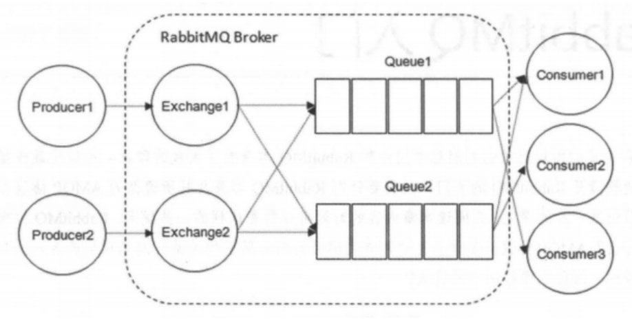
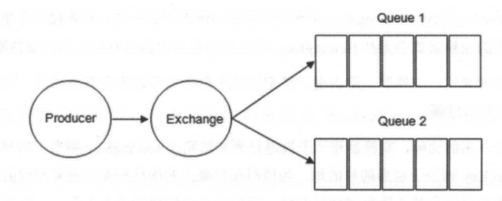
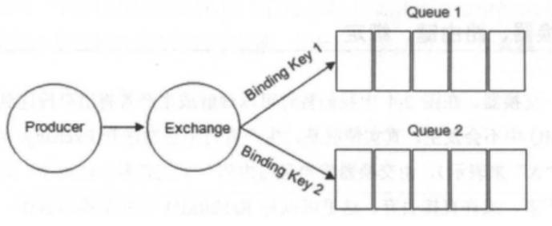
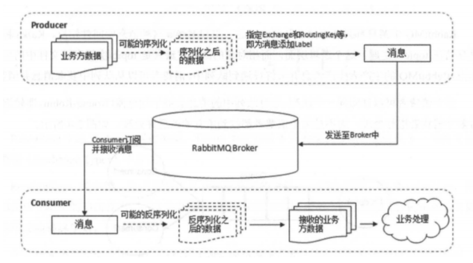
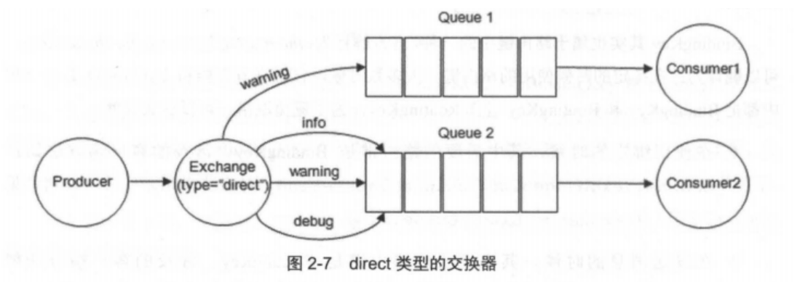
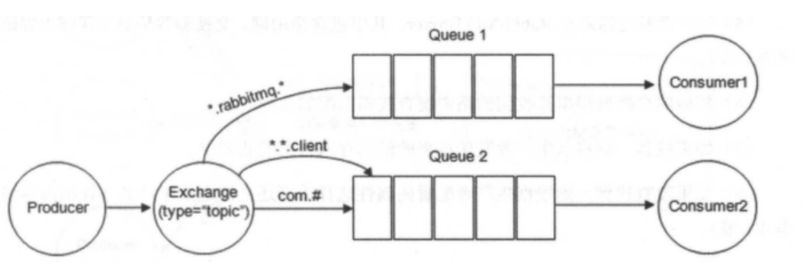

# RabbitMQ简介

​		消息队列在分布式系统中主要是为了解耦和削峰。

​		RabbitMQ是采用Erlang语言实现AMOP(Advanced Message Queuing Protocol，高级消息队列协议)的中间件，它最初起源于金融系统，用于在分布式系统中存储转发消息。

​		RabbitMQ发展到今天，被越来越多的人认可，这和它在易用性、拓展性、可靠性和高可用性等方面的卓著表现是分不开的。RabbitMQ的具体特点可以概括为以下几点：

- **可靠性**：RabbitMQ使用一些机制来保证消息的可靠性，如持久化、传输确认及发布确认等。
- **灵活的路由**：在消息进入队列之前，通过交换器来路由消息。对于典型的路由功能，RabbitMQ已经提供了一些内置的交换器来实现。针对更复杂的路由功能，可以将多个交换器绑定在一起，也可以通过插件机制来实现自己的交换器。
- **扩展性**：多个RabbitMQ节点可以组成一个集群，也可以根据实际业务情况动态地扩展集群中节点。
- **高可用性**：队列可用在集群中的机器上设置镜像，使得在部分节点出现问题的情况下队列仍然可用。
- **支持多种协议**：RabbitMQ除了原生支持AMQP协议，还支持STOMP、MQTT等多种消息中间件协议。
- **多语言客户端**：RabbitMQ几乎支持所有常用语言。
- **易用的管理界面**：RabbitMQ提供了一个易用的用户界面，使得用户可以监控和管理消息、集群中的节点等。
- **插件机制**：RabbitMQ提供了许多插件，已实现从多方面进行扩展，当前也可以编写自己的插件。

# RabbitMQ核心概念

​		RabbitMQ整体上是一个生产者与消费者模型，主要负责接收、存储和转发消息。可以把消息传递的过程想象成：当你将一个包裹送到邮局，邮局会暂存并最终将邮件通过邮递员送到收件人的手中，RabbitMQ就好比邮局、邮箱和邮递员组成的一个系统。从计算机术语层面来说，RabbitMQ模型更像是一种交换机模型。

​		下面再来看看图1：RabbitMQ的整体模型结构。

## Producer(生产者)和Consumer(消费者)

- **Producer(生产者)**：生产消息的一方(邮件投递者)
- **Consumer(消费者)**：消费消息的一方(邮件收件人)

​		消息一般由2部分组成：**消息头**（或者说是标签Label）和**消息体**。消息体也可以成为payLoad，消息体是不透明的，而消息头则有一系列的可选属性组成，这些属性包括routing-key(路由键)、priority(相对于其他消息的优先权)、delivery-mode(指出该消息可能需要持久化存储)等。生产者把消息交给RabbitMQ后，RabbitMQ会根据消息头把消息发送给感兴趣的Consumer(消费者)。

## Exchange(交换器)

​		在RabbitMQ中，消息并不是直接投递到**Queue(消息队列)**中的，中间还必须经过**Exchange(交换器)**这一层，Exchange(交换器)会把我们的消息分配到对于的**Queue(消息队列)**中。

​		**Exchange(交换器)**用来接收生产者发送的消息并将这些消息路由给服务器中的队列中，如果路由不到，或许会返回给**Producer(生产者)**，或许会被直接丢弃掉。这里可以将RabbitMQ中的交换器看作一个简单的实体。

​		**RabbitMQ的Exchange(交换器)有4种类型，不同的类型对应着不同的路由策略：direct(默认)、fanout、topic和headers**，不同类型的Exchange转发消息的策略有所区别。这个会在介绍**Exchange Types(交换器类型)**的时候介绍到。

​		Exchange(交换器)示意图如下：

​		生产者将消息发给交换器的时候，一般会指定一个**RoutingKey(路由键)**，用来指定这个消息的路由规则，而这个**RoutingKey需要与交换器类型和绑定建(BindingKey)联合使用才能最终生效。**

​		RabbitMQ中通过**Binding(绑定)**将**Exchange(交换器)**与**Queue(消息队列)**关联起来，在绑定的时候一般会指定一个**BindingKey(绑定键)**，这样RabbitMQ就知道如何正确将消息路由到队列了，如下图所示。一个绑定就是基于路由键将交换器和消息队列连接起来的路由规则，所以可以将交换器理解成一个有绑定构成的路由表。Exchange和Queue的绑定可以是多对多的关系。

​		Binding(绑定)示意图：

​		生产者将消息发送给交换器时，需要一个RoutingKey，当BindingKey和RoutingKey匹配时，消息会被路由到对应的队列中。在绑定多个队列到同一个交换器的时候，这些绑定允许使用相同的BindingKey。BindingKey并不是在所有的情况下都生效，它依赖于交换器类型，比如fanout类型的交换器就会无视，而是将消息路由到所有绑定到该交换器的队列。

## Queue(消息队列)

​		**Queue(消息队列)**用来保存消息知道发送给消费者。它是消息的容器，也是消息的终点。一个消息可投入一个或多个队列。消息一直在队列里面，等待消费者连接到这个队列将其取走。

​		RabbitMQ中消息只能存储在**队列**中，这一点和**Kafka**这种消息中间件相反。Kafka将消息存储在**topic(主题)**这个逻辑层面，而相对应的队列逻辑只是topic实际存储文件中的位移标识。RabbitMQ的生产者生产消息并最终投递到队列中，消费者可以从队列中获取消息并消费。

​		**多个消费者可以订阅同一个队列**，这时队列中的消息会被平均分摊(Round-Robin, 轮询)给多个消费者进行处理，而不是每个消费者都收到所有的消息并处理，这样避免消息被重复消费。

​		**RabbitMQ不支持队列层面的广播消费**，如果有广播消费的需求，需要在其上进行二次开发，这样会很麻烦，不建议这样做。

## Broker(消息中间件的服务节点)

​		对于RabbitMQ来说，一个RabbitMQ Broker可以简单地看作一个RabbitMQ服务节点，或者RabbitMQ服务实例。大多数情况下也可以将一个RabbitMQ Broker看作一台RabbitMQ服务器。

​		下图展示了生产者将消息存入RabbitMQ Broker，以及消费者从Broker中消费数据的整个流程。

## Exchange Types(交换器类型)

​		RabbitMQ常用的Exchange Type有fanout、direct、topic、headers这四种(AMQP规范里还提到两种Exchange Type，分别是system与自定义，这里不予以描述)。

### fanout

​		fanout类型的exchange路由规则非常简单，它会把所有发送到该Exchange的消息路由到所有与它绑定的Queue中，不需要做任何判断操作，所以fanout类型是所有的交换机类型里面速度最快的。fanout类型常用来广播消息。

### direct

​		direct类型的exchange路由规则也很简单，它会把消息路由到那些BindingKey与RoutingKey完全匹配的Queue中。

​		以上图为例，如果发送消息的时候设置路由键为“warning”，那么消息就会路由到Queue 1和Queue 2。如果在发送消息的时候设置路由键为“info”或“debug”，消息只会路由到Queue 2。如果以其他的路由键发送消息，则消息不会路由到这两个队列中。

​		direct类型常用在处理有优先级的任务，根据任务的优先级把消息发送到对应的队列，这样可以指派更多的资源去处理高优先级的队列。

### topic

​		前面讲到direct类型的交换器路由规则是完全匹配BindingKey和RoutingKey，但是这种严格的匹配方式在很多情况下不能满足实际业务的需求。topic类型的交换器在匹配规则上进行了拓展，它与direct类型的交换器相似，也是将消息路由到BindingKey和RoutingKey相匹配的队列中，但这里的匹配规则有些不同，它约定：

- RoutingKey为一个点号“.”分隔的字符串(被点号“.”分隔开的每一段独立的字符串称为一个单词)，如“com.rabbitmq.client”、“java.util.concurrent”、“com.hidden.client”;
- BindingKey和RoutingKey一样也是点号“.”分隔的字符串；
- BindingKey中可以存在两种特殊字符串`“*”`和“#”, `“*”`用于做模糊匹配，其中`*`用于匹配一个单词，`#`用于匹配多个单词(可以是零个)。

以上图为例：

- 路由键"com.rabbitmq.client"的消息会同时路由到Queue 1和Queue 2
- 路由键“com.hidden.client”的消息只会路由到Queue 2
- 路由键为 “com.hidden.demo” 的消息只会路由到 Queue 2 中；
- 路由键为 “java.rabbitmq.demo” 的消息只会路由到Queue 1中；
- 路由键为 “java.util.concurrent” 的消息将会被丢弃或者返回给生产者（需要设置 mandatory 参数），因为它没有匹配任何路由键。

### headers(不推荐)

​		headers类型的交换器不依赖与路由键的匹配规则来路由消息，而是根据发送的消息内容中headers属性进行匹配。在绑定队列和交换器时制定一组键值对，当发送消息到交换器时，RabbitMQ会获取到该消息的headers（也是一个键值对的形式）对比其中的键值对是否完全匹配队列和交换器绑定时指定的键值对，如果完全匹配则消息会路由到该队列，否则不会路由到该队列。headers类型的交换器性能很差，而且也不实用，基本上不会看到它的存在。